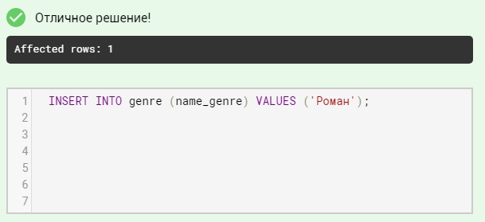
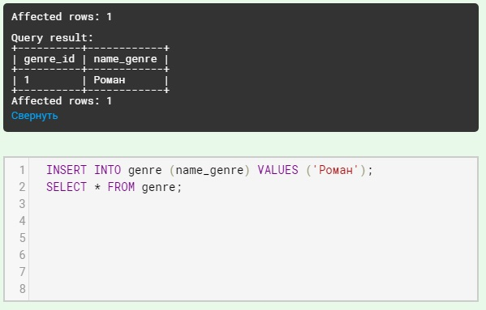

# Вставка записи в таблицу

Для занесения новой записи в таблицу используется SQL запрос, в котором указывается в какую таблицу, в какие поля заносить новые значения. Структура запроса:

- ключевые слова `INSERT INTO` (ключевое слово `INTO` можно пропустить);
- имя таблицы, в которую добавляется запись;
- открывающая круглая скобка «(»;
- список полей через запятую, в которые следует занести новые данные;
- закрывающая скобка «)»;
- ключевое слово `VALUES`;
- открывающая круглая скобка «(»;
- список значений через запятую, которые заносятся в соответствующие поля, при этом текстовые значения заключаются в кавычки, числовые значения записываются без кавычек, в качестве разделителя целой и дробной части используется точка;
- закрывающая скобка «)».

**Пример**. В `таблицу`, состоящую из двух столбцов добавим новую строку, при этом в `поле1` заносится `значение1`,  в `поле2` - `значение2`.

```mysql
INSERT INTO таблица(поле1, поле2) 
VALUES (значение1, значение2);
```

В результате выполнения запроса новая запись заносится в конец обновляемой таблицы.

При составлении списка полей и списка значений необходимо учитывать следующее:

- количество полей и количество значений в списках должны совпадать;
- должно существовать прямое соответствие между позицией одного и того же элемента в обоих списках, поэтому первый элемент списка значений должен относиться к первому столбцу в списке столбцов, второй – ко второму столбцу и т.д.;
- при добавлении значений SQL пытает преобразовать их к типу данных поля, например, при занесении строки '1' в числовое поле, вставляемое значение преобразуется к целому числу 1, если же попытаться занести строку 'ab' в числовое поле - возникнет ошибка и строка не будет добавлена;
- но желательно, во избежание ошибок, следовать правилу "типы данных элементов в списке значений должны быть совместимы с типами данных соответствующих столбцов таблицы" (целое число можно занести в поле типа DECIMAL, обратная операция приведет к округлению вещественного значения, что может повлиять на корректность данных);
- новые значения не рекомендуется добавлять в поля, описанные как `PRIMARY KEY AUTO_INCREMENT`;
- рекомендуется заполнять все поля записи, если же поле пропущено, значение этого поля зависит от установленных по умолчанию значений, если значения не установлены в поле вставляется пустое значение (`NULL`).

**Пример**

Вставим новую запись в таблицу `genre`, созданную на предыдущем шаге ( в первых двух строках показана структура таблицы, далее - ее содержимое):

| **genre_id**                   | **name_genre** |
|--------------------------------|----------------|
| INT PRIMARY KEY AUTO_INCREMENT | VARCHAR(30)    |
| 1                              | Роман          |

*Запрос:*

```mysql
INSERT INTO genre (name_genre) 
VALUES ('Роман');
```

Заносится только значение поля `name_genre`, значение ключевого поля формируется автоматически.

Результат:  в таблицу будет вставлена новая строка, после запуска запроса на платформе **stepik**, имеем:

<p float="left">

</p>

Чтобы увидеть как именно выглядит таблица `genre`, можно добавить SQL запрос, который выберет все записи из таблицы:

```mysql
SELECT * FROM genre;
```

*Результат:*

<p float="left">

</p>

**Задание**

Занесите новую строку в таблицу `book` (текстовые значения (тип `VARCHAR`) заключать либо в двойные, либо в одинарные кавычки):

| **book_id**                    | **title**          | **author**     | **price**        | **amount** |
|--------------------------------|--------------------|----------------|------------------|------------|
| INT PRIMARY KEY AUTO_INCREMENT | VARCHAR(50)        | VARCHAR(30)    | DECIMAL(8,2)     | INT        |
| 1                              | Мастер и Маргарита | Булгаков М.А.  | 670.99           | 3          |

**Рекомендация**: текстовые поля копируйте из таблицы, представленной в задании, и вставляйте в запрос во избежание ошибок...

*Результат:*

```mysql
Affected rows: 1
Query result:
+---------+--------------------+---------------+--------+--------+
| book_id | title              | author        | price  | amount |
+---------+--------------------+---------------+--------+--------+
| 1       | Мастер и Маргарита | Булгаков М.А. | 670.99 | 3      |
+---------+--------------------+---------------+--------+--------+
```

Введите SQL запрос

```mysql
INSERT INTO book (title, author, price, amount) 
VALUES 
  (
    'Мастер и Маргарита', 
    'Булгаков М.А.', 670.99, 
    3
  );
```

Вы получили: 1 балл из 1
