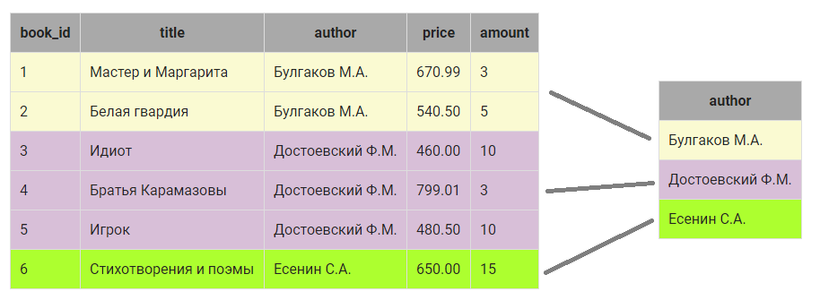
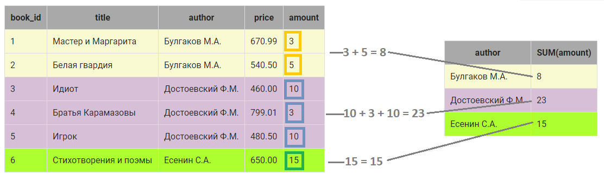

# Выборка данных, групповые функции SUM и COUNT

При группировке над элементами столбца, входящими в группу можно выполнить различные действия, например, просуммировать их или найти количество элементов в группе.

Подробно рассмотрим, как осуществляется группировка данных по некоторому столбцу и вычисления над группой на следующем примере:

```mysql
SELECT author, sum(amount), count(amount)
FROM book
GROUP BY author;
```

1. В таблице `book` определяются строки, в которых в столбце `author` одинаковые значения:

<p float="left">

</p>

Получили 3 различные группы:

- **группа I** объединяет две записи, у которых в столбце `author` значение Булгаков М.А.;
- **группа II** объединяет три записи, у которых в столбце `author` значение Достоевский Ф.М.;
- **группа III** объединяет одну запись, у которой в столбце `author` значение Есенин С.А.

2. Вместо каждой группы в результирующий запрос включается  одна запись. Запись как минимум включает значение столбца, по которому осуществляется группировка (в нашем случае это `author`):

<p float="left">

</p>

3. Дальше можно выполнить вычисления над элементами КАЖДОЙ группы в отдельности, например, посчитать общее количество экземпляров книг каждого автора. Для этого используется групповая функция `SUM()`, а в скобках указывается столбец, по которому нужно выполнить суммирование ( в нашем случае `amount`):

<p float="left">

</p>

4. Также можно посчитать, сколько записей относится к группе. Для этого используется функция `COUNT()`, в скобках можно указать ЛЮБОЙ столбец из группы, если группа не содержит пустых значений (ниже приведен пример, в котором показано, как работает `COUNT()`, если в группе есть пустые значения):

<p float="left">

</p>

**Пример**

Посчитать, сколько экземпляров книг каждого автора хранится на складе.

*Запрос:*

```mysql
SELECT author, SUM(amount)
FROM book
GROUP BY author;
```

*Результат:*

```mysql
+------------------+-------------+
| author           | SUM(amount) |
+------------------+-------------+
| Булгаков М.А.    | 8           |
| Достоевский Ф.М. | 23          |
| Есенин С.А.      | 15          |
+------------------+-------------+
```

**Пример**

Посчитать, сколько различных книг каждого автора хранится на складе.

Только для этого примера в таблицу `book` добавлена запись с пустыми значениями в столбцах `amount` и `price`:

```mysql
+---------+-----------------------+------------------+--------+--------+
| book_id | title                 | author           | price  | amount |
+---------+-----------------------+------------------+--------+--------+
| 1       | Мастер и Маргарита    | Булгаков М.А.    | 670.99 | 3      |
| 2       | Белая гвардия         | Булгаков М.А.    | 540.50 | 5      |
| 3       | Идиот                 | Достоевский Ф.М. | 460.00 | 10     |
| 4       | Братья Карамазовы     | Достоевский Ф.М. | 799.01 | 3      |
| 5       | Игрок                 | Достоевский Ф.М. | 480.50 | 10     |
| 6       | Стихотворения и поэмы | Есенин С.А.      | 650.00 | 15     |
| 7       | Черный человек        | Есенин С.А.      | Null   | Null   |
+---------+-----------------------+------------------+--------+--------+
```

*Запрос:*

```mysql
/* чтобы проверить запрос, добавьте в таблицу строку */
INSERT INTO book (title, author, price, amount) VALUES ('Черный человек','Есенин С.А.', Null, Null);

SELECT author, COUNT(author), COUNT(amount), COUNT(*)
FROM book
GROUP BY author;
```

*Результат:*

```mysql
+------------------+---------------+---------------+----------+
| author           | COUNT(author) | COUNT(amount) | COUNT(*) |
+------------------+---------------+---------------+----------+
| Булгаков М.А.    | 2             | 2             | 2        |
| Достоевский Ф.М. | 3             | 3             | 3        |
| Есенин С.А.      | 2             | 1             | 2        |
+------------------+---------------+---------------+----------+
```

Из таблицы с результатами запроса видно, что функцию `COUNT()` можно применять к любому столбцу, в том числе можно использовать и `*`, если таблица не содержит пустых значений. Если же в столбцах есть значения `Null`, (для группы по автору Есенин в нашем примере), то
- `COUNT(*)` —  подсчитывает  все записи, относящиеся к группе, в том числе и со значением `NULL`;
- `COUNT(имя_столбца)` — возвращает количество записей конкретного столбца (только `NOT NULL`), относящихся к группе.

ВАЖНО.
- Если столбец указан в `SELECT` **БЕЗ** применения групповой функции, то он обязательно должен быть указан и в `GROUP BY`.Иначе получим ошибку.
- Между названием функции и скобкой **НЕЛЬЗЯ СТАВИТЬ ПРОБЕЛ**. Это особенность платформы.

**Задание**

Посчитать, количество различных книг и количество экземпляров книг каждого автора , хранящихся на складе. Столбцы назвать `Автор`, `Различных_книг` и `Количество_экземпляров` соответственно.

Введите SQL запрос

*Результат:*

```mysql
Query result:
+------------------+----------------+------------------------+
| Автор            | Различных_книг | Количество_экземпляров |
+------------------+----------------+------------------------+
| Булгаков М.А.    | 2              | 8                      |
| Достоевский Ф.М. | 3              | 23                     |
| Есенин С.А.      | 1              | 15                     |
+------------------+----------------+------------------------+
Affected rows: 3
```

```mysql
SELECT 
  author AS Автор, 
  COUNT(title) AS Различных_книг, 
  SUM(amount) AS Количество_экземпляров 
FROM 
  book 
GROUP BY 
  Автор;
```

Вы получили: 1 балл из 1
