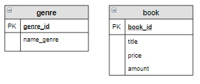

# Связь «многие ко многим»

На предыдущем шаге мы реализовали связь «**один ко многим**» для книг и авторов. Она означает, что каждый автор написал несколько книг, но каждую книгу написал только один автор. На самом деле, это не совсем верное утверждение. Например, книга «12 стульев» написана двумя авторами Ильфом И.А. и Петровым Е.П. С другой стороны, эти авторы написали и другие книги, например «Золотой теленок».

Для соединения таких таблиц используется связь «**многие ко многим**».

Связь «**многие ко многим**» имеет место когда каждой записи одной таблицы соответствует несколько записей во второй, и наоборот, каждой записи второй таблицы соответствует несколько записей в первой. Обозначается это так:

**Этапы реализации связи** «**многие ко многим**»  на следующем примере:

Один автор может написать несколько книг, а одна книга может быть написана несколькими авторами. Для каждой книги известны ее количество и цена.

1. Создать таблицу `author`, в которую включить уникальных авторов книг, хранящихся на складе:

2. В обеих таблицах необходимо определить первичный ключ, в нашем случае в таблице `book` он уже есть, поэтому достаточно включить первичный ключ `author_id` в таблицу `author`:

3. Создать новую таблицу-связку, состоящую из двух столбцов, соответствующих по имени и типу ключевым столбцам исходных таблиц. Каждый из этих столбцов является внешним ключом (`FOREIGN KEY`)  и связан с ключевым столбцом каждой таблицы. Для наглядности связи на схеме обозначаются стрелкой от ключевого столбца исходной таблицы к внешнему ключу связной таблицы.

4. Дальше необходимо определиться с первичным ключом таблицы-связки. Можно сделать два ключевых столбца, тогда все записи в этой таблице должны быть уникальными, то есть не повторяться. Для связи автор-книга этот вариант подходит. Но в некоторых случаях записи в таблице-связке могут повторяться, например, если мы будем продавать книги покупателям (один человек может купить несколько книг, а одну и ту же книгу могут купить несколько человек). Тогда в таблицу-связку включают дополнительные столбцы для идентификации записей, например, дату продажи,  также в таблицу-связку добавляют первичный ключ. Мы воспользуемся вторым способом:

**Задание**

Добавить новую характеристику книги – ее жанр, если считать, что каждая книга может относиться к нескольким жанрам, а каждый жанр включает несколько книг, то есть между ними определена связь «**многие ко многим**».

Расположите в правильном порядке этапы связывания таблиц `genre` и `book`.

**Расположите элементы списка в правильном порядке**

| ❔ | ✅                                                           |
|---|-------------------------------------------------------------|
| 1 | 
  
 |
| 2 | 
  
 |
| 3 | 
  
 |
| 4 | 
  
 |

Вы получили: 1 балл из 1
