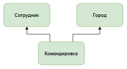
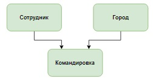

# Задание

**Задание**

Дана таблица `trip`. Выберите одну или несколько схем, которые позволяют правильно представить информацию из этой таблицы в виде нескольких связанных таблиц.

| **trip_id**                    | **name**        | **city**        | **per_diem**   | **date_first**  | **date_last**     |
|:-------------------------------|:----------------|:----------------|:---------------|:----------------|:------------------|
| 1                              | Баранов П.Е.    | Москва          | 700            | 2020-01-12      | 2020-01-17        |
| 2                              | Абрамова К.А.   | Владивосток     | 450            | 2020-01-14      | 2020-01-27        |
| 3                              | Семенов И.В.    | Москва          | 700            | 2020-01-23      | 2020-01-31        |
| 4                              | Ильиных Г.Р.    | Владивосток     | 450            | 2020-01-12      | 2020-02-02        |

**Выберите все подходящие ответы из списка**

|   |                                                          |
|---|----------------------------------------------------------|
| ✅ | 
  
 |
| ❌ | 
  
 |
| ❌ | 
  
 |
| ❌ | 
  
 |
| ✅ | 
  
 |

Вы получили: 1 балл из 1
