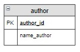

# Перекрестное соединение CROSS JOIN

Оператор перекрёстного соединения, или декартова произведения `CROSS JOIN` (в запросе вместо ключевых слов можно поставить запятую между таблицами) соединяет две таблицы. Порядок таблиц для оператора неважен, поскольку оператор является симметричным. Его структура:

```mysql
SELECT
 ...
FROM
    таблица_1 CROSS JOIN таблица_2
...
```

или

```mysql
SELECT
 ...
FROM
    таблица_1, таблица_2
...
```

Результат запроса формируется так: каждая строка одной таблицы соединяется с каждой строкой другой таблицы, формируя  в результате все возможные сочетания строк двух таблиц.

Например, запрос:

```mysql
SELECT name_author, name_genre
FROM 
    author, genre;
```

каждому автору из таблицы `author` поставит в соответствие все возможные жанры из таблицы `genre`:

```mysql
+------------------+-------------+
| name_author      | name_genre  |
+------------------+-------------+
| Булгаков М.А.    | Роман       |
| Булгаков М.А.    | Поэзия      |
| Булгаков М.А.    | Приключения |
| Достоевский Ф.М. | Роман       |
| Достоевский Ф.М. | Поэзия      |
| Достоевский Ф.М. | Приключения |
| Есенин С.А.      | Роман       |
| Есенин С.А.      | Поэзия      |
| Есенин С.А.      | Приключения |
| Пастернак Б.Л.   | Роман       |
| Пастернак Б.Л.   | Поэзия      |
| Пастернак Б.Л.   | Приключения |
| Лермонтов М.Ю.   | Роман       |
| Лермонтов М.Ю.   | Поэзия      |
| Лермонтов М.Ю.   | Приключения |
+------------------+-------------+
```

**Задание**

Есть список городов, хранящийся в таблице `city`:

| **city_id** | **name_city**   |
|:------------|:----------------|
| 1           | Москва          |
| 2           | Санкт-Петербург |
| 3           | Владивосток     |

Необходимо в каждом городе провести выставку книг каждого автора в течение 2020 года. Дату проведения выставки выбрать случайным образом. Создать запрос, который выведет город, автора и дату проведения выставки. Последний столбец назвать **Дата**. Информацию вывести, отсортировав сначала в алфавитном порядке по названиям городов, а потом по убыванию дат проведения выставок.

**Структура таблицы:**

<p float="left">

</p>

Введите SQL запрос

*Результат:*

```mysql
Query result:
+-----------------+------------------+------------+
| name_city       | name_author      | Дата       |
+-----------------+------------------+------------+
| Владивосток     | Булгаков М.А.    | 2020-11-29 |
| Владивосток     | Пастернак Б.Л.   | 2020-09-17 |
| Владивосток     | Есенин С.А.      | 2020-09-06 |
| Владивосток     | Лермонтов М.Ю.   | 2020-07-29 |
| Владивосток     | Достоевский Ф.М. | 2020-04-16 |
| Москва          | Есенин С.А.      | 2020-11-22 |
| Москва          | Достоевский Ф.М. | 2020-04-10 |
| Москва          | Пастернак Б.Л.   | 2020-03-28 |
| Москва          | Булгаков М.А.    | 2020-01-28 |
| Москва          | Лермонтов М.Ю.   | 2020-01-21 |
| Санкт-Петербург | Пастернак Б.Л.   | 2020-11-15 |
| Санкт-Петербург | Есенин С.А.      | 2020-08-02 |
| Санкт-Петербург | Булгаков М.А.    | 2020-05-12 |
| Санкт-Петербург | Достоевский Ф.М. | 2020-03-24 |
| Санкт-Петербург | Лермонтов М.Ю.   | 2020-02-27 |
+-----------------+------------------+------------+
Affected rows: 15
```

```mysql
SELECT name_city, name_author, (DATE_ADD('2020-01-01', INTERVAL FLOOR(RAND() * 365) DAY)) AS Дата
FROM city, author
ORDER BY name_city, Дата DESC;
```

Вы получили: 1 балл из 1
