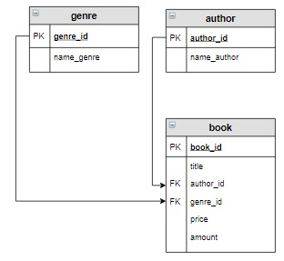

# Запросы на выборку из нескольких таблиц

Запрос на выборку может выбирать данные из двух и более таблиц базы данных. При этом таблицы должны быть логически связаны между собой. Для каждой пары таблиц, включаемых в запрос, необходимо указать свой оператор соединения. Наиболее распространенным является внутреннее соединение `INNER JOIN`, поэтому в примерах будем использовать его.

Пусть таблицы связаны между собой следующим образом:

<p float="left">

</p>

тогда запрос на выборку для этих таблиц будет иметь вид:

```mysql
SELECT
 ...
FROM
    first 
    INNER JOIN  second ON first.first_id = second.first_id
    INNER JOIN  third  ON second.second_id = third.second_id
...
```

Если же таблицы связаны так:

<p float="left">

</p>

то запрос на выборку выглядит следующим образом:

```mysql
SELECT
 ...
FROM
    first 
    INNER JOIN  third ON first.first_id = third.first_id
    INNER JOIN second ON third.second_id = second.second_id 
...
```

В этом случае рекомендуется соединение таблиц записывать последовательно, «по кругу»: `first → third → second`.

**Пример**

Вывести информацию о тех книгах, их авторах и жанрах, цена которых принадлежит интервалу от 500  до 700 рублей  включительно.

*Запрос:*

```mysql
SELECT title, name_author, name_genre, price, amount
FROM
    author 
    INNER JOIN  book ON author.author_id = book.author_id
    INNER JOIN genre ON genre.genre_id = book.genre_id
WHERE price BETWEEN 500 AND 700;  
```

*Результат:*

```mysql
+-----------------------+----------------+------------+--------+--------+
| title                 | name_author    | name_genre | price  | amount |
+-----------------------+----------------+------------+--------+--------+
| Мастер и Маргарита    | Булгаков М.А.  | Роман      | 670.99 | 3      |
| Белая гвардия         | Булгаков М.А.  | Роман      | 540.50 | 5      |
| Стихотворения и поэмы | Есенин С.А.    | Поэзия     | 650.00 | 15     |
| Черный человек        | Есенин С.А.    | Поэзия     | 570.20 | 6      |
| Лирика                | Пастернак Б.Л. | Поэзия     | 518.99 | 2      |
+-----------------------+----------------+------------+--------+--------+
```

**Задание**

Вывести информацию о книгах (жанр, книга, автор), относящихся к жанру, включающему слово «роман» в отсортированном по названиям книг виде.

**Логическая схема базы данных:**

<p float="left">

</p>

Введите SQL запрос

*Результат:*

```mysql
Query result:
+------------+--------------------+------------------+
| name_genre | title              | name_author      |
+------------+--------------------+------------------+
| Роман      | Белая гвардия      | Булгаков М.А.    |
| Роман      | Братья Карамазовы  | Достоевский Ф.М. |
| Роман      | Игрок              | Достоевский Ф.М. |
| Роман      | Идиот              | Достоевский Ф.М. |
| Роман      | Мастер и Маргарита | Булгаков М.А.    |
+------------+--------------------+------------------+
Affected rows: 5
```

```mysql
SELECT name_genre, title, name_author
FROM author 
     INNER JOIN  book ON author.author_id = book.author_id
     INNER JOIN genre ON genre.genre_id = book.genre_id
WHERE name_genre LIKE "%роман%"
ORDER BY title;
```

Вы получили: 1 балл из 1
