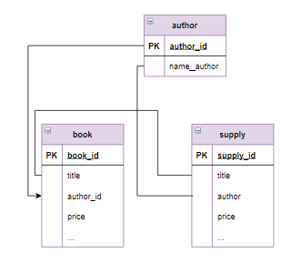

# Запросы на обновление, связанные таблицы

В запросах на обновление можно использовать связанные таблицы:

```mysql
UPDATE таблица_1
     ... JOIN таблица_2
     ON выражение
     ...
SET ...   
WHERE ...;
```

При этом исправлять данные можно во всех используемых в запросе таблицах.

**Пример**

Для книг, которые уже есть на складе (в таблице `book`) по той же цене, что и в поставке (`supply`), увеличить количество на значение, указанное в поставке, а также обнулить количество этих книг в поставке.

Этот запрос должен отобрать строки из таблиц `book` и `supply` такие, что у них совпадают и автор, и название книги. Но в таблице `supply` фамилия автора записана не числом (`id`), а текстом. Следовательно, чтобы выполнить сравнение по фамилии автора нужно "подтянуть" таблицу `author`, которая связана с `book` по столбцу `author_id`. И в логическом выражении, описывающем соединение таблиц, можно будет использовать столбцы из таблиц `book`, `author` и `supply`. 

Если таблицы логически связаны по двум и более столбцам (на рисунке связи обозначены линиями), возможно через другие таблицы, условие соединение будет включать связи по нужным столбцам через логический оператор `AND`. Например, для следующих таблиц логическую связь по названию и автору:

<p float="left">

</p>

условие соединения можно записать в виде:

```mysql
book INNER JOIN author ON author.author_id = book.author_id
     INNER JOIN supply ON book.title = supply.title 
                          and supply.author = author.name_author
```

*Запрос:*

```mysql
UPDATE book 
     INNER JOIN author ON author.author_id = book.author_id
     INNER JOIN supply ON book.title = supply.title 
                         and supply.author = author.name_author
SET book.amount = book.amount + supply.amount,
    supply.amount = 0   
WHERE book.price = supply.price;

SELECT * FROM book;

SELECT * FROM supply;
```

*Результат:*

```mysql
Affected rows: 4

Query result:
+---------+-----------------------+-----------+----------+--------+--------+
| book_id | title                 | author_id | genre_id | price  | amount |
+---------+-----------------------+-----------+----------+--------+--------+
| 1       | Мастер и Маргарита    | 1         | 1        | 670.99 | 3      |
| 2       | Белая гвардия         | 1         | 1        | 540.50 | 12     |
| 3       | Идиот                 | 2         | 1        | 460.00 | 10     |
| 4       | Братья Карамазовы     | 2         | 1        | 799.01 | 3      |
| 5       | Игрок                 | 2         | 1        | 480.50 | 10     |
| 6       | Стихотворения и поэмы | 3         | 2        | 650.00 | 15     |
| 7       | Черный человек        | 3         | 2        | 570.20 | 12     |
| 8       | Лирика                | 4         | 2        | 518.99 | 2      |
+---------+-----------------------+-----------+----------+--------+--------+
Affected rows: 8

Query result:
+-----------+-----------------------+------------------+--------+--------+
| supply_id | title                 | author           | price  | amount |
+-----------+-----------------------+------------------+--------+--------+
| 1         | Доктор Живаго         | Пастернак Б.Л.   | 380.80 | 4      |
| 2         | Черный человек        | Есенин С.А.      | 570.20 | 0      |
| 3         | Белая гвардия         | Булгаков М.А.    | 540.50 | 0      |
| 4         | Идиот                 | Достоевский Ф.М. | 360.80 | 3      |
| 5         | Стихотворения и поэмы | Лермонтов М.Ю.   | 255.90 | 4      |
| 6         | Остров сокровищ       | Стивенсон Р.Л.   | 599.99 | 5      |
+-----------+-----------------------+------------------+--------+--------+
Affected rows: 6
```

Под нужное нам условие подходят две книги «Белая гвардия» Булгакова и «Черный человек» Есенина. В таблице `book` их количество увеличилось, а в таблице `supply` - обнулилось.

**Задание**

Для книг, которые уже есть на складе (в таблице `book`), но по другой цене, чем в поставке (`supply`), необходимо в таблице `book` увеличить количество на значение, указанное в поставке,  и пересчитать цену. А в таблице `supply` обнулить количество этих книг. Формула для пересчета цены:

$$tax=\frac{S*\frac{k_1}{100}}{1+\frac{k}{100}},$$

$$S\\_without\\_tax=\frac{S}{1+\frac{k}{100}}$$

$$price=\frac{p_1*k_1+p_2*k_2}{k_1+k_2}$$

где  *p1*, *p2* - цена книги в таблицах `book` и `supply`;

*k1*, *k2* - количество книг в таблицах `book` и `supply`.

Введите SQL запрос

*Результат:*

```mysql
Affected rows: 2
```

```mysql
UPDATE book b
       INNER JOIN author ON author.author_id = b.author_id
       INNER JOIN supply s ON s.title = b.title AND s.author = author.name_author
SET b.price = ROUND((b.price*b.amount + s.price*s.amount)/(b.amount + s.amount),2),
    b.amount = b.amount + s.amount,
    s.amount = 0
WHERE b.price <> s.price;
```

Вы получили: 1 балл из 1
