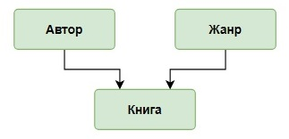

# Запросы корректировки, соединение таблиц

С помощью запросов корректировки данных решим задачу о занесении в базу книг, привезенных на склад поставщиком.

База данных о книгах  включает три таблицы `genre`, `author` и `book`, информация о поставке занесена в таблицу `supply`. С разными типами книг из поставки необходимо выполнить разные действия:
- для книг, которые уже есть на складе по той же цене, что и в поставке, - увеличить их количество на значение, указанное в поставке (пример);
- для книг, которые уже есть на складе, но цена книги в поставке отличается, - увеличить количество экземпляров и вычислить новую цену, при расчете учесть количество имеющихся и новых экземпляров книг (задание);
- для книг, которых на складе нет, - проверить, есть ли  автор книги в базе, если нет - занести фамилию автора, а потом добавить новую запись о книге, оставив поле для описания жанра пустым;
- задать жанр для новых книг.

Еще одно типовое действие на складе - удаление устаревшей информации. С помощью запросов корректировки удаление данных о жанрах, авторах и книгах выполняется в зависимости от того, какие свойства внешних ключей были указаны в таблицах при их создании:
- каскадное удаление записей связанных таблиц;
- удаление записей в главной таблице с сохранением записей в зависимой;
- удаление записей с использованием информации из связанных таблиц.

**Структура и наполнение таблицы**

**Концептуальная схема базы данных:**

**Логическая схема базы данных:**

Таблица `author`(создание, заполнение):

| **author_id** | **name_author**  |
|:--------------|:-----------------|
| 1             | Булгаков М.А.    |
| 2             | Достоевский Ф.М. |
| 3             | Есенин С.А.      |
| 4             | Пастернак Б.Л.   |
| 5             | Лермонтов М.Ю.   |

Таблица `genre`(создание, заполнение, рассмотрено в качестве примеров):

| **genre_id** | **name_genre** |
|:-------------|:---------------|
| 1            | Роман          |
| 2            | Поэзия         |
| 3            | Приключения    |

Таблица `book`(создание, заполнение):

| **book_id** | **title**             | **author_id** | **genre_id** | **price**    | **amount** |
|:------------|:----------------------|:--------------|:-------------|:-------------|:-----------|
| 1           | Мастер и Маргарита    | 1             | 1            | 670.99       | 3          |
| 2           | Белая гвардия         | 1             | 1            | 540.50       | 5          |
| 3           | Идиот                 | 2             | 1            | 460.00       | 10         |
| 4           | Братья Карамазовы     | 2             | 1            | 799.01       | 3          |
| 5           | Игрок                 | 2             | 1            | 480.50       | 10         |
| 6           | Стихотворения и поэмы | 3             | 2            | 650.00       | 15         |
| 7           | Черный человек        | 3             | 2            | 570.20       | 6          |
| 8           | Лирика                | 4             | 2            | 518.99       | 2          |

Таблица `supply`(создание, заполнение):

| **supply_id** | **title**             | **author**       | **price** | **amount** |
|:--------------|:----------------------|:-----------------|:----------|:-----------|
| 1             | Доктор Живаго         | Пастернак Б.Л.   | 380.80    | 4          |
| 2             | Черный человек        | Есенин С.А.      | 570.20    | 6          |
| 3             | Белая гвардия         | Булгаков М.А.    | 540.50    | 7          |
| 4             | Идиот                 | Достоевский Ф.М. | 360.80    | 3          |
| 5             | Стихотворения и поэмы | Лермонтов М.Ю.   | 255.90    | 4          |
| 6             | Остров сокровищ       | Стивенсон Р.Л.   | 599.99    | 5          |
