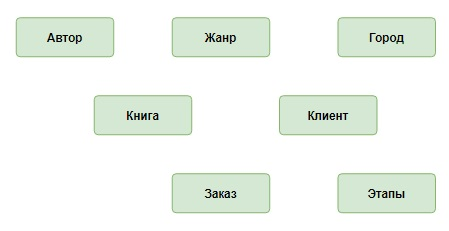
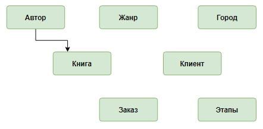
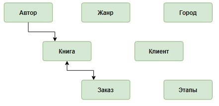
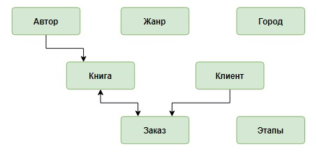
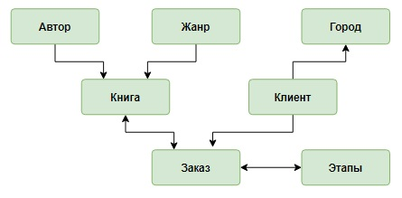
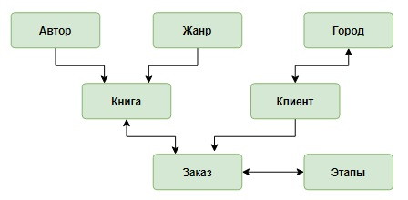
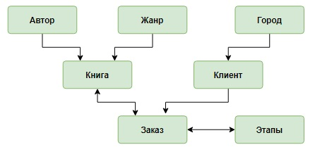

# Проектирование концептуальной модели базы данных

**Шаг 1.** Детально проанализировать предметную область и выделить те информационные объекты, которые будут храниться в базе данных (выделены зеленым):
- В интернет-магазине продаются ***книги***. Каждая книга имеет название, написана одним ***автором***, относится к одному ***жанру***, имеет определенную цену. В магазине в наличии есть несколько экземпляров каждой книги. 
- ***Покупатель*** регистрируется на сайте интернет-магазина, задает свое имя и фамилию,  электронную почту и ***город*** проживания (для упрощения считаем, что человек не может поменять свой город проживания). Он может сформировать один или несколько ***заказов***, для каждого заказа написать какие-то пожелания. Каждый заказ включает одну или несколько книг, каждую книгу можно заказать в нескольких экземплярах. Затем заказ проходит ряд последовательных ***этапов*** (операций): оплачивается, упаковывается, передается курьеру или транспортной компании для транспортировки и, наконец, доставляется покупателю. Фиксируется дата каждой операции. Для каждого города известно среднее время доставки книг.
- При этом в магазине ведется учет книг, при покупке их количество уменьшается, при поступлении товара увеличивается, при исчерпании количества – оформляется заказ и пр.

**Шаг 2.** Для каждого выделенного информационного объекта указать его характеристики, для этого:

а) сначала выделить их в описании предметной области (синий цвет): 
- В интернет-магазине продаются книги. Каждая книга имеет ***название***, написана одним автором, относится к одному жанру, имеет определенную ***цену***. В магазине в наличии есть ***несколько экземпляров*** каждой книги. 
- Покупатель регистрируется на сайте интернет-магазина, задает свое ***имя и фамилию***,  ***электронную почту*** и город проживания. Он может сформировать один или несколько заказов, для каждого заказа написать какие-то ***пожелания***. Каждый заказ включает ***одну или несколько книг***, каждую книгу можно заказать ***в нескольких экземплярах***. Затем заказ проходит ряд последовательных этапов(операций): оплачивается, упаковывается, передается курьеру или транспортной компании для транспортировки и, наконец, доставляется покупателю. Фиксируется ***дата каждой операции***. Для каждого города известно ***среднее время доставки книг***.
- При этом в магазине ведется учет книг, при покупке их количество уменьшается, при поступлении товара увеличивается, при исчерпании количества – оформляется заказ и пр.

б) затем связать их с информационным объектом:
- **Книга** – название, количество, цена;
- **Автор** – фамилия и инициалы;
- **Жанр** – название;
- **Покупатель (клиент)** – фамилия и имя, электронная почта;
- **Город** – название, среднее время доставки;
- **Заказ** – код заказа, пожелания;
- **Этап** – название этапов.

в) перечислить характеристики, которые остались не привязанными к информационным объектам (к ним необходимо вернуться при реализации связей между таблицами):
- книги в заказе;
- количество книг в заказе;
- дата каждой операции.

**Шаг 3.** Нарисовать схему, на которой изобразить информационные объекты в виде прямоугольников:

**Шаг 4.** Установить связи между информационными объектами. Связь «один ко многим» обозначить в виде →, «многие ко многим» –  ↔.

- Каждая ***книга*** написана одним ***автором***, каждый ***автор*** написал несколько ***книг***, следовательно между этими таблицами связь «один ко многим»:

- Каждая ***книга*** может включаться в несколько ***заказов***, один ***заказ*** может содержать несколько ***книг***, между этими таблицами связь «многие ко многим»:

- Каждый ***клиент*** может сформировать несколько ***заказов***, каждый ***заказ*** формируется только одним ***клиентом***:

**Задание**

Установите связи между информационными объектами ***Жанр*** и ***Книга***, ***Город*** и ***Клиент***, ***Заказ*** и ***Этапы***. Выберите верную концептуальную схему.

**Выберите один вариант из списка**

|   |                                                            |
|---|------------------------------------------------------------|
| 🔴 | 
  
 |
| 🔴 | 
  
 |
| 🟢 | 
  
 |

Вы получили: 1 балл из 1
