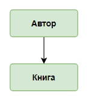
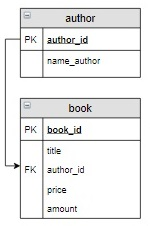
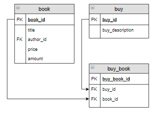
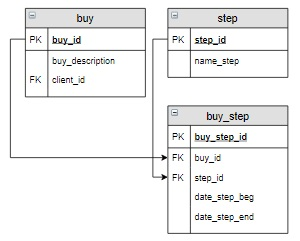

# Построение логической схемы базы данных

На предыдущем шаге получена концептуальная модель базы данных:

На основе этой модели создается логическая модель, в которой информационные объекты описываются в виде реляционных таблиц.

Для каждой пары таблиц необходимо выполнить следующие шаги:

**Шаг 1.** Выбрать пару таблиц из схемы, например:

**Шаг 2.** Разработать структуру таблиц для каждого информационного объекта. Таблица в качестве столбцов должна включать все характеристики информационного объекта, полученные на этапе концептуального проектирования, кроме тех, которые соответствуют названиям других информационных объектов. Они будут включены в таблицы при создании связей. В нашем случае это:

**Шаг 3.** Реализовать связь между таблицами, в нашем случае это связь «один ко многим»:

**Шаг 4.** Вернуться к описанию концептуальной модели и проверить, нужно ли включить какие-то характеристики, непривязанные к информационным объектам? В нашем случае ничего добавлять не надо. Чаще всего характеристики добавляются при реализации связи «многие ко многим».

Продолжим построение логической схемы:

**Шаг 1.** Выберем следующую пару таблиц:

**Шаг 2.** Структура таблиц каждого информационного объекта (сохраняем уже полученные ранее структуры таблиц):

**Шаг 3.** Реализуем связь «многие ко многим»:

**Шаг 4.** В описании предметной области указывается, что нужно хранить количество книг, которые включены в заказ. Добавим эту характеристику в таблицу-связку `buy_book`:

Аналогично создаются реляционные таблицы для остальных пар информационных объектов.

**Задание**

Сопоставьте фрагменты концептуальной модели с фрагментами логической модели.

**Сопоставьте значения из двух списков**

| ❔                                                           | ✅                                                           |
|-------------------------------------------------------------|-------------------------------------------------------------|
| 
  
 | 
  
 |
| 
  
 | 
  
 |
| 
  
 | 
  
  |
| 
  
 | 
  
   |

Вы получили: 1 балл из 1
