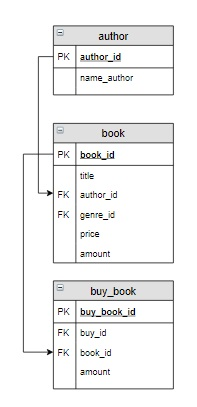

# Задание

**Задание**

Посчитать, сколько раз была заказана каждая книга, для книги вывести ее автора (нужно посчитать, в каком количестве заказов фигурирует каждая книга).  Вывести фамилию и инициалы автора, название книги, последний столбец назвать `Количество`. Результат отсортировать сначала  по фамилиям авторов, а потом по названиям книг.

**Фрагмент логической схемы базы данных:**

<p float="left">

</p>

Введите SQL запрос

*Результат:*

```mysql
Query result:
+------------------+-----------------------+------------+
| name_author      | title                 | Количество |
+------------------+-----------------------+------------+
| Булгаков М.А.    | Белая гвардия         | 1          |
| Булгаков М.А.    | Мастер и Маргарита    | 2          |
| Достоевский Ф.М. | Братья Карамазовы     | 0          |
| Достоевский Ф.М. | Игрок                 | 1          |
| Достоевский Ф.М. | Идиот                 | 2          |
| Есенин С.А.      | Стихотворения и поэмы | 0          |
| Есенин С.А.      | Черный человек        | 1          |
| Пастернак Б.Л.   | Лирика                | 1          |
+------------------+-----------------------+------------+
Affected rows: 8
```

```mysql
SELECT name_author, title, (COUNT(buy_book.amount)) AS Количество
FROM book
     INNER JOIN author ON author.author_id = book.author_id
     LEFT JOIN buy_book ON buy_book.book_id = book.book_id
GROUP BY book.book_id
ORDER BY name_author, title;
```

Вы получили: 1 балл из 1
