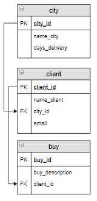

# Задание

**Задание**

Вывести города, в которых живут клиенты, оформлявшие заказы в интернет-магазине. Указать количество заказов в каждый город, этот столбец назвать `Количество`. Информацию вывести по убыванию количества заказов, а затем в алфавитном порядке по названию городов.

**Фрагмент логической схемы базы данных:**

<p float="left">

</p>

Введите SQL запрос

*Результат:*

```mysql
Query result:
+-----------------+------------+
| name_city       | Количество |
+-----------------+------------+
| Владивосток     | 2          |
| Москва          | 1          |
| Санкт-Петербург | 1          |
+-----------------+------------+
Affected rows: 3
```

```mysql
SELECT name_city, (COUNT(buy.buy_id)) AS Количество
FROM city
     INNER JOIN client USING(city_id)
     INNER JOIN buy USING(client_id)
GROUP BY name_city
ORDER BY Количество DESC, name_city;
```

Вы получили: 1 балл из 1
