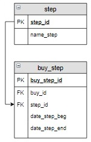

# Задание

**Задание**

Вывести номера всех оплаченных заказов и даты, когда они были оплачены.

**Фрагмент логической схемы базы данных:**

<p float="left">

</p>

Введите SQL запрос

*Результат:*

```mysql
Query result:
+--------+---------------+
| buy_id | date_step_end |
+--------+---------------+
| 1      | 2020-02-20    |
| 2      | 2020-02-28    |
| 3      | 2020-03-05    |
+--------+---------------+
Affected rows: 3
```

```mysql
SELECT buy_id, date_step_end
FROM buy_step
     INNER JOIN step USING(step_id)
WHERE name_step = "Оплата" AND date_step_end IS NOT NULL;
```

Вы получили: 1 балл из 1
