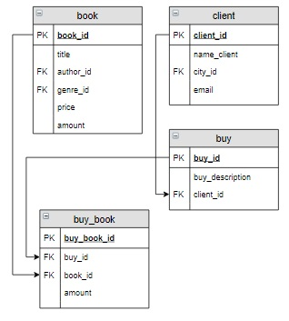

# Задание

**Задание**

Вывести информацию о каждом заказе: его номер, кто его сформировал (фамилия пользователя) и его стоимость (сумма произведений количества заказанных книг и их цены), в отсортированном по номеру заказа виде. Последний столбец назвать `Стоимость`.

**Фрагмент логической схемы базы данных:**

<p float="left">

</p>

Введите SQL запрос

*Результат:*

```mysql
Query result:
+--------+----------------+-----------+
| buy_id | name_client    | Стоимость |
+--------+----------------+-----------+
| 1      | Баранов Павел  | 2271.39   |
| 2      | Семенонов Иван | 1037.98   |
| 3      | Абрамова Катя  | 2131.49   |
| 4      | Баранов Павел  | 480.50    |
+--------+----------------+-----------+
Affected rows: 4
```

```mysql
SELECT buy_id, name_client, (SUM(buy_book.amount*book.price)) AS Стоимость
FROM buy
     INNER JOIN client USING(client_id)
     INNER JOIN buy_book USING(buy_id)
     INNER JOIN book ON book.book_id = buy_book.book_id
GROUP BY buy_id
ORDER BY buy_id;
```

Вы получили: 1 балл из 1
