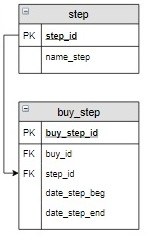

# Задание

**Задание**

Вывести номера заказов (`buy_id`) и названия этапов,  на которых они в данный момент находятся. Если заказ доставлен –  информацию о нем не выводить. Информацию отсортировать по возрастанию `buy_id`.

**Фрагмент логической схемы базы данных:**

<p float="left">

</p>

Введите SQL запрос

*Результат:*

```mysql
Query result:
+--------+-----------------+
| buy_id | name_step       |
+--------+-----------------+
| 2      | Транспортировка |
| 3      | Доставка        |
| 4      | Оплата          |
+--------+-----------------+
Affected rows: 3
```

```mysql
SELECT buy_id, name_step
FROM buy_step INNER JOIN step USING(step_id)
WHERE date_step_beg IS NOT NULL AND date_step_end IS NULL
ORDER BY buy_id;
```

Вы получили: 1 балл из 1
