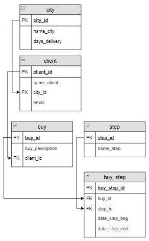

# Задание

**Задание**

В таблице `city` для каждого города указано количество дней, за которые заказ может быть доставлен в этот город (рассматривается только этап **Транспортировка**). Для тех заказов, которые прошли этап транспортировки, вывести количество дней за которое заказ реально доставлен в город. А также, если заказ доставлен с опозданием, указать количество дней задержки, в противном случае вывести 0. В результат включить номер заказа (`buy_id`), а также вычисляемые столбцы `Количество_дней` и `Опоздание`. Информацию вывести в отсортированном по номеру заказа виде.

**Фрагмент логической схемы базы данных:**

<p float="left">

</p>

Введите SQL запрос

*Результат:*

```mysql
Query result:
+--------+-----------------+-----------+
| buy_id | Количество_дней | Опоздание |
+--------+-----------------+-----------+
| 1      | 14              | 2         |
| 3      | 4               | 0         |
+--------+-----------------+-----------+
Affected rows: 2
```

```mysql
SELECT buy.buy_id, (DATEDIFF(date_step_end, date_step_beg)) AS Количество_дней,
       IF(DATEDIFF(date_step_end, date_step_beg) > days_delivery,
          DATEDIFF(date_step_end, date_step_beg) - days_delivery, 0) AS Опоздание
FROM buy
     INNER JOIN client   USING(client_id)
     INNER JOIN city     USING(city_id)
     INNER JOIN buy_step USING(buy_id)
     INNER JOIN step     USING(step_id)
WHERE name_step = 'Транспортировка' AND date_step_end IS NOT NULL
ORDER BY buy.buy_id;
```

Вы получили: 1 балл из 1
