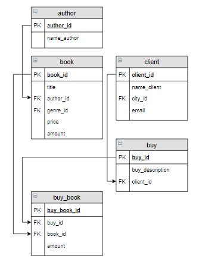

# Задание

**Задание**

Выбрать всех клиентов, которые заказывали книги Достоевского, информацию вывести в отсортированном по алфавиту виде. В решении используйте фамилию автора, а не его `id`.

**Фрагмент логической схемы базы данных:**

<p float="left">

</p>

Введите SQL запрос

*Результат:*

```mysql
Query result:
+---------------+
| name_client   |
+---------------+
| Абрамова Катя |
| Баранов Павел |
+---------------+
Affected rows: 2
```

```mysql
SELECT name_client
FROM buy
     INNER JOIN client   USING(client_id)
     INNER JOIN buy_book USING(buy_id)
     INNER JOIN book     USING(book_id)
     INNER JOIN author   USING(author_id)
WHERE name_author LIKE 'Достоев%'
GROUP BY name_client
ORDER BY name_client;
```

Вы получили: 1 балл из 1
