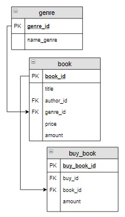

# Задание

**Задание**

Вывести жанр (или жанры), в котором было заказано больше всего экземпляров книг, указать это количество. Последний столбец назвать **Количество**.

**Фрагмент логической схемы базы данных:**

<p float="left">

</p>

Введите SQL запрос

*Результат:*

```mysql
Query result:
+------------+------------+
| name_genre | Количество |
+------------+------------+
| Роман      | 7          |
+------------+------------+
Affected rows: 1
```

```mysql
SELECT name_genre, SUM(buy_book.amount) AS Количество
FROM buy_book
     INNER JOIN book USING(book_id)
     INNER JOIN genre USING(genre_id)
GROUP BY name_genre
HAVING SUM(buy_book.amount) = (SELECT SUM(buy_book.amount) AS МАКС_Количество
                               FROM buy_book
                                    INNER JOIN book USING(book_id)
                                    INNER JOIN genre USING(genre_id)
                               GROUP BY name_genre
                               ORDER BY МАКС_Количество DESC
                               LIMIT 1);
```

Вы получили: 1 балл из 1
