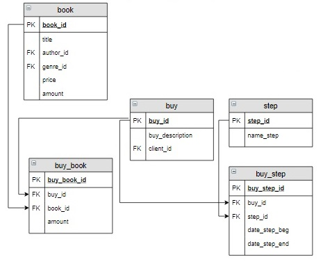
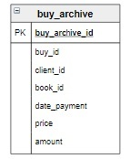

# Задание

**Задание**

Для каждой отдельной книги необходимо вывести информацию о количестве проданных экземпляров и их стоимости за 2020 и 2019 год . За 2020 год проданными считать те экземпляры, которые уже оплачены. Вычисляемые столбцы назвать `Количество` и `Сумма`. Информацию отсортировать по убыванию стоимости.

**Фрагмент логической схемы базы данных:**

<p float="left">

</p>

Информация о продажах за 2020 год содержится в таблицах базы данных (считаем, что 2020 - текущий год). Информация о продажах 2019 года (то есть условно прошлого года) хранится в таблице `buy_archive` следующей структуры:

<p float="left">

</p>

Введите SQL запрос

*Результат:*

```mysql
Query result:
+-----------------------+------------+---------+
| title                 | Количество | Сумма   |
+-----------------------+------------+---------+
| Братья Карамазовы     | 8          | 6247.20 |
| Мастер и Маргарита    | 6          | 4024.38 |
| Идиот                 | 5          | 2281.80 |
| Белая гвардия         | 3          | 1581.10 |
| Черный человек        | 2          | 1140.40 |
| Лирика                | 2          | 1037.98 |
| Игрок                 | 2          | 961.80  |
| Стихотворения и поэмы | 1          | 650.00  |
+-----------------------+------------+---------+
Affected rows: 8
```

```mysql
SELECT temp.title, SUM(temp.Количество) AS Количество, SUM(temp.Сумма) AS Сумма
FROM (SELECT book.title, SUM(buy_archive.amount) AS Количество, SUM(buy_archive.amount*buy_archive.price) AS Сумма
      FROM buy_archive INNER JOIN book USING(book_id)
      GROUP BY book.title
      UNION ALL
      SELECT book.title, SUM(buy_book.amount) AS Количество, SUM(buy_book.amount*book.price) AS Сумма
      FROM book
           INNER JOIN buy_book USING(book_id)
           INNER JOIN buy      USING(buy_id)
           INNER JOIN buy_step USING(buy_id)
           INNER JOIN step     USING(step_id)
      WHERE date_step_end IS NOT NULL AND name_step = 'Оплата'
      GROUP BY book.title) AS temp
GROUP BY title
ORDER BY Сумма DESC;
```

Вы получили: 1 балл из 1
