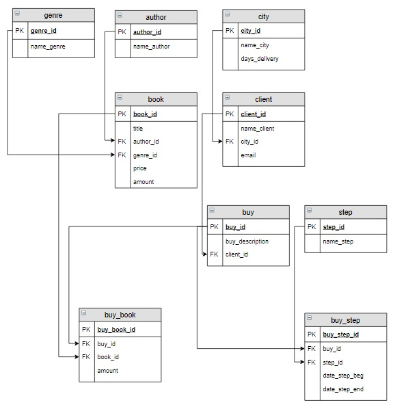

# База данных «Интернет-магазин книг», запросы на выборку

**Предметная область**

В интернет-магазине продаются книги. Каждая книга имеет название, написана одним автором, относится к одному жанру, имеет определенную цену. В магазине в наличии есть несколько экземпляров каждой книги. 

Покупатель регистрируется на сайте интернет-магазина, задает свое имя и фамилию, электронную почту и город проживания. Он может сформировать один или несколько заказов, для каждого заказа написать какие-то пожелания. Каждый заказ включает одну или несколько книг, каждую книгу можно заказать в нескольких экземплярах. Затем заказ проходит ряд последовательных этапов (операций): оплачивается, упаковывается, передается курьеру или транспортной компании для транспортировки и, наконец, доставляется покупателю. Фиксируется дата каждой операции. Для каждого города известно среднее время доставки книг.

При этом в магазине ведется учет книг, при покупке их количество уменьшается, при поступлении товара увеличивается, при исчерпании количества – оформляется заказ и пр.

В данном уроке сначала будет построена концептуальная модель базы данных, затем ее логическая модель. Также будут определены структура и содержание таблиц базы данных «Интернет-магазин книг».

Затем для разработанной базы данных рассматриваются следующие запросы:
- Вывести фамилии всех клиентов, которые заказали определенную книгу.
- Посчитать, сколько раз была заказана каждая книга.
- Вывести города, в которых живут клиенты магазина.
- Вывести информацию об оплате каждого заказа.
- Вывести подробную информацию о каждом заказе.
- Вывести информацию о движении каждого заказа.
- Вывести заказы, доставленные с опозданием.
- Вывести клиентов, которые заказывали книги определенного автора.
- Вывести самый популярный жанр.
- Сравнить ежемесячную выручку за текущий и прошлый год.

**Создание базы данных**

**Логическая модель базы данных**

Логическая модель базы данных служит основой для физической модели, в которой определяются характеристики каждого столбца (тип и другие опции). После создания структуры, таблицы наполняются информацией.

**Структура и наполнение таблиц базы данных «Интернет-магазин книг»**

Таблица `author` (создание, заполнение):

| **author_id** | **name_author**  |
|:--------------|:-----------------|
| 1             | Булгаков М.А.    |
| 2             | Достоевский Ф.М. |
| 3             | Есенин С.А.      |
| 4             | Пастернак Б.Л.   |
| 5             | Лермонтов М.Ю.   |

Таблица `genre` (создание, заполнение, рассмотрено в качестве примеров):

| **genre_id** | **name_genre** |
|:-------------|:---------------|
| 1            | Роман          |
| 2            | Поэзия         |
| 3            | Приключения    |

Таблица `book` (создание, заполнение):

| **book_id** | **title**             | **author_id** | **genre_id** | **price**    | **amount** |
|:------------|:----------------------|:--------------|:-------------|:-------------|:-----------|
| 1           | Мастер и Маргарита    | 1             | 1            | 670.99       | 3          |
| 2           | Белая гвардия         | 1             | 1            | 540.50       | 5          |
| 3           | Идиот                 | 2             | 1            | 460.00       | 10         |
| 4           | Братья Карамазовы     | 2             | 1            | 799.01       | 2          |
| 5           | Игрок                 | 2             | 1            | 480.50       | 10         |
| 6           | Стихотворения и поэмы | 3             | 2            | 650.00       | 15         |
| 7           | Черный человек        | 3             | 2            | 570.20       | 6          |
| 8           | Лирика                | 4             | 2            | 518.99       | 2          |

Таблица `city` (в последнем столбце указано примерное количество дней, необходимое для доставки товара в каждый город):

| **city_id**                      | **name_city**   | **days_delivery** |
|:---------------------------------|:----------------|:------------------|
| `INT PRIMARY KEY AUTO_INCREMENT` | `VARCHAR(30)`   | `INT`             |
| 1                                | Москва          | 5                 |
| 2                                | Санкт-Петербург | 3                 |
| 3                                | Владивосток     | 12                |

Таблица `client`:

| **client_id**                    | **name_client** | **city_id** | **email**      |
|:---------------------------------|:----------------|:------------|:---------------|
| `INT PRIMARY KEY AUTO_INCREMENT` | `VARCHAR(50)`   | `INT`       | `VARCHAR(30)`  |
| 1                                | Баранов Павел   | 3           | baranov@test   |
| 2                                | Абрамова Катя   | 1           | abramova@test  |
| 3                                | Семенонов Иван  | 2           | semenov@test   |
| 4                                | Яковлева Галина | 1           | yakovleva@test |

Таблица `buy` (столбец `buy_description` предназначен для пожеланий покупателя, которые он хочет добавить в свой заказ, если пожеланий нет - поле остается пустым):

| **buy_id**                       | **buy_description**                   | **client_id** |
|:---------------------------------|:--------------------------------------|:--------------|
| `INT PRIMARY KEY AUTO_INCREMENT` | `VARCHAR(100)`                        | `INT`         |
| 1                                | Доставка только вечером               | 1             |
| 2                                |                                       | 3             |
| 3                                | Упаковать каждую книгу по отдельности | 2             |
| 4                                |                                       | 1             |

Таблица `buy_book`:

| **buy_book_id**                  | **buy_id** | **book_id** | **amount** | 
|:---------------------------------|:-----------|:------------|:-----------| 
| `INT PRIMARY KEY AUTO_INCREMENT` | `INT`      | `INT`       | `INT`      |
| 1                                | 1          | 1           | 1          |
| 2                                | 1          | 7           | 2          |
| 3                                | 1          | 3           | 1          |
| 4                                | 2          | 8           | 2          |
| 5                                | 3          | 3           | 2          |
| 6                                | 3          | 2           | 1          |
| 7                                | 3          | 1           | 1          |
| 8                                | 4          | 5           | 1          |

Таблица `step`:

| **step_id**                      | **name_step**   |
|:---------------------------------|:----------------|
| `INT PRIMARY KEY AUTO_INCREMENT` | `VARCHAR(30)`   |
| 1                                | Оплата          |
| 2                                | Упаковка        |
| 3                                | Транспортировка |
| 4                                | Доставка        |

Таблица `buy_step` (если столбец `date_step_end` не заполнен (имеет значение `Null`), это означает что операция еще не выполнена, например для заказа с `id` 2, книги переданы для доставки 2020-03-02, но еще не доставлены):

| **buy_step_id**                  | **buy_id** | **step_id** | **date_step_beg** | **date_step_end** |
|:---------------------------------|:-----------|:------------|:------------------|:------------------|
| `INT PRIMARY KEY AUTO_INCREMENT` | `INT`      | `INT`       | `DATE`            | `DATE`            |
| 1                                | 1          | 1           | 2020-02-20        | 2020-02-20        |
| 2                                | 1          | 2           | 2020-02-20        | 2020-02-21        |
| 3                                | 1          | 3           | 2020-02-22        | 2020-03-07        |
| 4                                | 1          | 4           | 2020-03-08        | 2020-03-08        |
| 5                                | 2          | 1           | 2020-02-28        | 2020-02-28        |
| 6                                | 2          | 2           | 2020-02-29        | 2020-03-01        |
| 7                                | 2          | 3           | 2020-03-02        |                   |
| 8                                | 2          | 4           |                   |                   |
| 9                                | 3          | 1           | 2020-03-05        | 2020-03-05        |
| 10                               | 3          | 2           | 2020-03-05        | 2020-03-06        |
| 11                               | 3          | 3           | 2020-03-06        | 2020-03-10        |
| 12                               | 3          | 4           | 2020-03-11        |                   |
| 13                               | 4          | 1           | 2020-03-20        |                   |
| 14                               | 4          | 2           |                   |                   |
| 15                               | 4          | 3           |                   |                   |
| 16                               | 4          | 4           |                   |                   |
