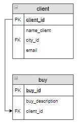

# Задание

**Задание**

Создать новый заказ для Попова Ильи. Его комментарий для заказа: «Связаться со мной по вопросу доставки».

**Фрагмент логической схемы базы данных:**

<p float="left">

</p>

Введите SQL запрос

*Результат:*

```mysql
Affected rows: 1
```

```mysql
INSERT INTO buy (buy_description, client_id)
SELECT 'Связаться со мной по вопросу доставки', client_id
FROM client
WHERE name_client = 'Попов Илья';
```

Вы получили: 1 балл из 1
