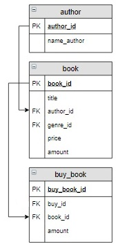

# Задание

**Задание**

В таблицу `buy_book` добавить заказ с номером 5. Этот заказ должен содержать книгу Пастернака «Лирика» в количестве двух экземпляров и книгу Булгакова «Белая гвардия» в одном экземпляре.

**Фрагмент логической схемы базы данных:**

<p float="left">

</p>

Введите SQL запрос

*Результат:*

```mysql
Affected rows: 2
```

```mysql
INSERT INTO buy_book (buy_id, book_id, amount)
VALUES (5, (SELECT book_id
            FROM book INNER JOIN author USING(author_id)
            WHERE title = 'Лирика' AND name_author LIKE '%Пастернак%'), 2),
       (5, (SELECT book_id
            FROM book INNER JOIN author USING(author_id)
            WHERE title = 'Белая гвардия' AND name_author LIKE '%Булгаков%'), 1);
```

Вы получили: 1 балл из 1
