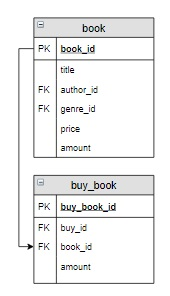

# Задание

**Задание**

Количество тех книг на складе, которые были включены в заказ с номером 5, уменьшить на то количество, которое в заказе с номером 5  указано.

**Фрагмент логической схемы базы данных:**

<p float="left">

</p>

Введите SQL запрос

*Результат:*

```mysql
Affected rows: 2
```

```mysql
UPDATE book INNER JOIN buy_book USING(book_id)
SET book.amount = book.amount - buy_book.amount
WHERE buy_book.buy_id = 5;
```

Вы получили: 1 балл из 1
