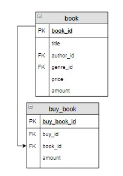

# Задание

**Задание**

Создать общий счет (таблицу `buy_pay`) на оплату заказа с номером 5. Куда включить номер заказа, количество книг в заказе (название столбца `Количество`) и его общую стоимость (название столбца `Итого`). Для решения используйте ОДИН запрос.

**Фрагмент логической схемы базы данных:**

<p float="left">

</p>

Введите SQL запрос

*Результат:*

```mysql
Affected rows: 1
```

```mysql
CREATE TABLE buy_pay
SELECT buy_id, SUM(buy_book.amount) AS Количество, SUM(buy_book.amount*price) AS Итого
FROM  buy_book INNER JOIN book USING(book_id)
WHERE buy_id = 5;
```

Вы получили: 1 балл из 1
