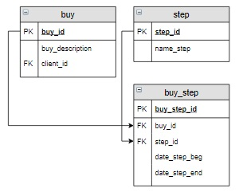

# Задание

**Задание**

В таблицу `buy_step` для заказа с номером 5 включить все этапы из таблицы `step`, которые должен пройти этот заказ. В столбцы `date_step_beg` и `date_step_end` всех записей занести `Null`.

**Фрагмент логической схемы базы данных:**

<p float="left">

</p>

Введите SQL запрос

*Результат:*

```mysql
Affected rows: 4
```

```mysql
INSERT INTO buy_step (buy_id, step_id)
SELECT 5, step_id FROM step;
```

Вы получили: 1 балл из 1
