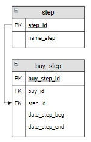

# Задание

**Задание**

В таблицу `buy_step` занести дату 12.04.2020 выставления счета на оплату заказа с номером 5.

Правильнее было бы занести не конкретную, а текущую дату. Это можно сделать с помощью функции `Now()`. Но при этом в разные дни будут вставляться разная дата, и задание нельзя будет проверить, поэтому  вставим дату 12.04.2020.

**Фрагмент логической схемы базы данных:**

<p float="left">

</p>

Введите SQL запрос

*Результат:*

```mysql
Affected rows: 1
```

```mysql
UPDATE buy_step JOIN step USING(step_id)
SET date_step_beg = '2020-04-12'
WHERE buy_id = 5 AND name_step = 'Оплата';
```

Вы получили: 1 балл из 1
