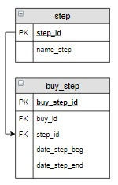

# Задание

**Задание**

Завершить этап «**Оплата**» для заказа с номером 5, вставив в столбец `date_step_end` дату 13.04.2020, и начать следующий этап («**Упаковка**»), задав в столбце `date_step_beg` для этого этапа ту же дату.

Реализовать два запроса для завершения этапа и начала следующего. Они должны быть записаны в общем виде, чтобы его можно было применять для любых этапов, изменив только текущий этап. Для примера пусть это будет этап «**Оплата**».

**Фрагмент логической схемы базы данных:**

<p float="left">

</p>

Введите SQL запрос

*Результат:*

```mysql
Affected rows: 1

Affected rows: 1
```

```mysql
UPDATE buy_step INNER JOIN step USING(step_id)
SET date_step_end = '2020-04-13'
WHERE buy_id = 5 AND name_step = 'Оплата';

UPDATE buy_step INNER JOIN step USING(step_id)
SET date_step_beg = '2020-04-13'
WHERE buy_id = 5 AND name_step = 'Упаковка';
```

Вы получили: 1 балл из 1
