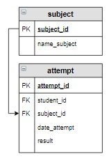

# Задание

**Задание**

Вывести, сколько попыток сделали студенты по каждой дисциплине, а также средний результат попыток, который округлить до 2 знаков после запятой. Под результатом попытки понимается процент правильных ответов на вопросы теста, который занесен в столбец `result`. В результат включить название дисциплины, а также вычисляемые столбцы `Количество` и `Среднее`. Информацию вывести по убыванию средних результатов.

**Фрагмент логической схемы базы данных:**

<p float="left">

</p>

Введите SQL запрос

*Результат:*

```mysql
Query result:
+-------------------+------------+---------+
| name_subject      | Количество | Среднее |
+-------------------+------------+---------+
| Основы SQL        | 4          | 58.25   |
| Основы баз данных | 3          | 55.67   |
| Физика            | 0          | NULL    |
+-------------------+------------+---------+
Affected rows: 3
```

```mysql
SELECT name_subject, COUNT(student_id) AS Количество, ROUND(AVG(result),2) AS Среднее
FROM attempt RIGHT JOIN subject USING(subject_id)
GROUP BY name_subject
ORDER BY Среднее DESC;
```

Вы получили: 1 балл из 1
