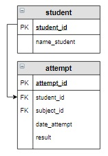

# Задание

**Задание**

Вывести студентов (различных студентов), имеющих максимальные результаты попыток. Информацию отсортировать в алфавитном порядке по фамилии студента.

Максимальный результат не обязательно будет 100%, поэтому явно это значение в запросе не задавать.

**Фрагмент логической схемы базы данных:**

<p float="left">

</p>

Введите SQL запрос

*Результат:*

```mysql
Query result:
+-----------------+--------+
| name_student    | result |
+-----------------+--------+
| Семенов Иван    | 100    |
| Яковлева Галина | 100    |
+-----------------+--------+
Affected rows: 2
```

```mysql
SELECT name_student, result
FROM student INNER JOIN attempt USING(student_id)
WHERE result = (SELECT result
                FROM attempt
                ORDER BY result DESC
                LIMIT 1)
ORDER BY name_student;
```

Вы получили: 1 балл из 1
