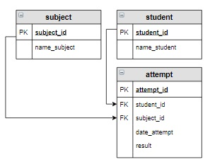

# Задание

**Задание**

Если студент совершал **несколько попыток** по одной и той же дисциплине, то вывести разницу в днях между первой и последней попыткой. В результат включить фамилию и имя студента, название дисциплины и вычисляемый столбец `Интервал`. Информацию вывести по возрастанию разницы. Студентов, сделавших одну попытку по дисциплине, не учитывать.

**Фрагмент логической схемы базы данных:**

<p float="left">

</p>

Введите SQL запрос

*Результат:*

```mysql
Query result:
+-----------------+-------------------+----------+
| name_student    | name_subject      | Интервал |
+-----------------+-------------------+----------+
| Яковлева Галина | Основы баз данных | 26       |
| Семенов Иван    | Основы SQL        | 55       |
+-----------------+-------------------+----------+
Affected rows: 2
```

```mysql
SELECT name_student, name_subject, (DATEDIFF(MAX(date_attempt), MIN(date_attempt))) AS Интервал
FROM attempt
     INNER JOIN subject USING(subject_id)
     INNER JOIN student USING(student_id)
GROUP BY name_student, name_subject
HAVING COUNT(date_attempt) > 1
ORDER BY Интервал;
```

Вы получили: 1 балл из 1
