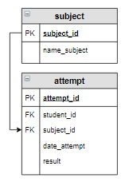

# Задание

**Задание**

Студенты могут тестироваться по одной или нескольким дисциплинам (не обязательно по всем). Вывести дисциплину и количество уникальных студентов (столбец назвать `Количество`), которые по ней проходили тестирование . Информацию отсортировать сначала по убыванию количества, а потом по названию дисциплины. В результат включить и дисциплины, тестирование по которым студенты еще не проходили, в этом случае указать количество студентов 0.

**Фрагмент логической схемы базы данных:**

<p float="left">

</p>

Введите SQL запрос

*Результат:*

```mysql
Query result:
+-------------------+------------+
| name_subject      | Количество |
+-------------------+------------+
| Основы SQL        | 2          |
| Основы баз данных | 2          |
| Физика            | 0          |
+-------------------+------------+
Affected rows: 3
```

```mysql
SELECT name_subject, COUNT(DISTINCT student_id) AS Количество
FROM subject LEFT JOIN attempt USING(subject_id)
GROUP BY name_subject
ORDER BY Количество DESC, name_subject;
```

Вы получили: 1 балл из 1
