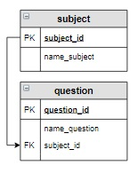

# Задание

**Задание**

Случайным образом отберите 3 вопроса по дисциплине «Основы баз данных». В результат включите столбцы `question_id` и `name_question`.

**Фрагмент логической схемы базы данных:**

<p float="left">

</p>

Введите SQL запрос

*Результат:*

```mysql
Query result:
+-------------+-----------------------------------------------------+
| question_id | name_question                                       |
+-------------+-----------------------------------------------------+
| 6           | База данных - это:                                  |
| 7           | Отношение - это:                                    |
| 9           | Какой тип данных не допустим в реляционной таблице? |
+-------------+-----------------------------------------------------+
Affected rows: 3
```

```mysql
SELECT question_id, name_question
FROM subject INNER JOIN question USING(subject_id)
WHERE name_subject = 'Основы баз данных'
ORDER BY RAND()
LIMIT 3;
```

Вы получили: 1 балл из 1
