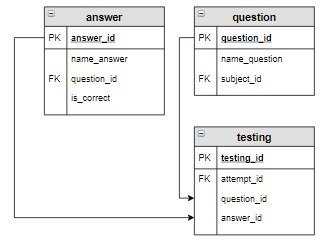

# Задание

**Задание**

Вывести вопросы, которые были включены в тест для Семенова Ивана по дисциплине «Основы SQL» 2020-05-17 (значение `attempt_id` для этой попытки равно 7). Указать, какой ответ дал студент и правильный он или нет (вывести **Верно** или **Неверно**). В результат включить вопрос, ответ и вычисляемый столбец `Результат`.

**Фрагмент логической схемы базы данных:**

<p float="left">

</p>

Введите SQL запрос

*Результат:*

```mysql
Query result:
+----------------------------------------------------------+-----------------------+-----------+
| name_question                                            | name_answer           | Результат |
+----------------------------------------------------------+-----------------------+-----------+
| Запрос на выборку начинается с ключевого слова:          | INSERT                | Неверно   |
| Какой запрос выбирает все записи из таблицы student:     | SELECT * FROM student | Верно     |
| Для внутреннего соединения таблиц используется оператор: | CROSS JOIN            | Неверно   |
+----------------------------------------------------------+-----------------------+-----------+
Affected rows: 3
```

```mysql
SELECT name_question, name_answer, IF(is_correct, 'Верно', 'Неверно') AS Результат
FROM question
     INNER JOIN testing USING(question_id)
     INNER JOIN answer USING(answer_id)
WHERE attempt_id = 7;
```

Вы получили: 1 балл из 1
