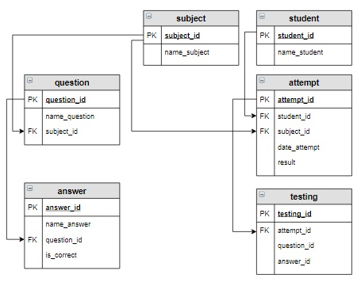

# Задание

**Задание**

Придумайте один или несколько запросов на выборку для предметной области «Тестирование» (в таблицы занесены данные, как на первом шаге урока). Проверьте, правильно ли они работают.

Сформировать шпаргалку со списком предметов, вопросов и ответов, где в каждом вопросе перед корректным ответом стоит стрелка '->' и этот ответ расположен первым среди остальных вариантов.

Вопросы и ответы обрезать до 30 символов и добавить к результату многоточие '...', но только в том случае, если строка обрезалась (была изначально длиннее 30 символов).

Столбцы полученной таблицы назвать 'Предмет', 'Вопрос', 'Ответ'.

**Логическая схема базы данных:**

<p float="left">

</p>

Введите SQL запрос

*Результат:*

```mysql
Query result:
+-------------------+-----------------------------------+--------------------------------------+
| Предмет           | Вопрос                            | Ответ                                |
+-------------------+-----------------------------------+--------------------------------------+
| Основы SQL        | Запрос на выборку начинается с... |    UPDATE                            |
| Основы SQL        | Запрос на выборку начинается с... | -> SELECT                            |
| Основы SQL        | Запрос на выборку начинается с... |    INSERT                            |
| Основы SQL        | Условие, по которому отбираютс... |    GROUP BY                          |
| Основы SQL        | Условие, по которому отбираютс... |    FROM                              |
| Основы SQL        | Условие, по которому отбираютс... | -> WHERE                             |
| Основы SQL        | Условие, по которому отбираютс... |    SELECT                            |
| Основы SQL        | Для сортировки используется:      |    SORT                              |
| Основы SQL        | Для сортировки используется:      | -> ORDER BY                          |
| Основы SQL        | Для сортировки используется:      |    RANG BY                           |
| Основы SQL        | Какой запрос выбирает все запи... | -> SELECT * FROM student             |
| Основы SQL        | Какой запрос выбирает все запи... |    SELECT student                    |
| Основы SQL        | Для внутреннего соединения таб... | -> INNER JOIN                        |
| Основы SQL        | Для внутреннего соединения таб... |    LEFT JOIN                         |
| Основы SQL        | Для внутреннего соединения таб... |    RIGHT JOIN                        |
| Основы SQL        | Для внутреннего соединения таб... |    CROSS JOIN                        |
| Основы баз данных | База данных - это:                | -> совокупность данных, организов... |
| Основы баз данных | База данных - это:                |    совокупность программ для хран... |
| Основы баз данных | Отношение - это:                  |    строка                            |
| Основы баз данных | Отношение - это:                  |    столбец                           |
| Основы баз данных | Отношение - это:                  | -> таблица                           |
| Основы баз данных | Концептуальная модель использу... | -> обобщенное представление польз... |
| Основы баз данных | Концептуальная модель использу... |    описание представления данных ... |
| Основы баз данных | Концептуальная модель использу... |    база данных                       |
| Основы баз данных | Какой тип данных не допустим в... | -> file                              |
| Основы баз данных | Какой тип данных не допустим в... |    INT                               |
| Основы баз данных | Какой тип данных не допустим в... |    VARCHAR                           |
| Основы баз данных | Какой тип данных не допустим в... |    DATE                              |
+-------------------+-----------------------------------+--------------------------------------+
Affected rows: 28
```

```mysql
SELECT subject.name_subject AS 'Предмет', IF(CHAR_LENGTH(question.name_question) > 30, 
                                             CONCAT(LEFT(question.name_question, 30), '...'), 
                                             question.name_question) AS 'Вопрос',
       IF(CHAR_LENGTH(answer.name_answer) > 30, 
           IF(answer.is_correct,
              CONCAT('-> ', LEFT(answer.name_answer, 30), '...'),
              CONCAT('   ', LEFT(answer.name_answer, 30), '...')),
           IF(answer.is_correct,
              CONCAT('-> ', answer.name_answer),
              CONCAT('   ', answer.name_answer))) AS 'Ответ'
FROM subject
     CROSS JOIN question ON subject.subject_id = question.subject_id
     CROSS JOIN answer ON answer.question_id = question.question_id
ORDER BY 'Предмет', 'Вопрос', 'Ответ' DESC;
```

Вы получили: 1 балл из 1
