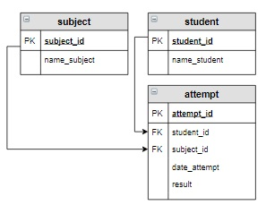

# Задание

**Задание**

В таблицу `attempt` включить новую попытку для студента Баранова Павла по дисциплине «Основы баз данных». Установить текущую дату в качестве даты выполнения попытки.

**Фрагмент логической схемы базы данных:**

<p float="left">

</p>

Введите SQL запрос

*Результат:*

```mysql
Affected rows: 1
```

```mysql
INSERT INTO attempt (student_id, subject_id, date_attempt, result)
SELECT student_id, subject_id, NOW(), NULL
FROM attempt
     INNER JOIN subject USING(subject_id)
     INNER JOIN student USING(student_id)
WHERE name_student = 'Баранов Павел' AND name_subject = 'Основы баз данных';
```

Вы получили: 1 балл из 1
