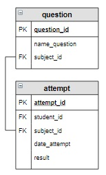
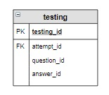

# Задание

**Задание**

Случайным образом выбрать три вопроса (запрос) по дисциплине, тестирование по которой собирается проходить студент, занесенный в таблицу `attempt` последним, и добавить их в таблицу `testing`. `id` последней попытки получить как максимальное значение `id` из таблицы `attempt`.

**Фрагмент логической схемы базы данных:**

<p float="left">

</p>

**Корректируемая таблица:**

<p float="left">

</p>

Введите SQL запрос

*Результат:*

```mysql
Affected rows: 3
```

```mysql
INSERT INTO testing (attempt_id, question_id)
SELECT attempt_id, question_id
FROM attempt INNER JOIN question USING(subject_id)
WHERE attempt_id = (SELECT MAX(attempt_id) FROM attempt)
ORDER BY RAND()
LIMIT 3;
```

Вы получили: 1 балл из 1
