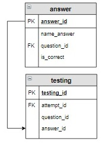
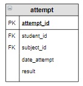

# Задание

**Задание**

Студент прошел тестирование (то есть все его ответы занесены в таблицу `testing`), далее необходимо вычислить результат(запрос) и занести его в таблицу `attempt` для соответствующей попытки. Результат попытки вычислить как количество правильных ответов, деленное на 3 (количество вопросов в каждой попытке) и умноженное на 100. Результат округлить до целого.

Будем считать, что мы знаем `id` попытки,  для которой вычисляется результат, в нашем случае это 8. В таблицу `testing` занесены следующие ответы пользователя:

```mysql
+------------+------------+-------------+-----------+
| testing_id | attempt_id | question_id | answer_id |
+------------+------------+-------------+-----------+
| 22         | 8          | 7           | 19        |
| 23         | 8          | 6           | 17        |
| 24         | 8          | 8           | 22        |
+------------+------------+-------------+-----------+
```

**Фрагмент логической схемы базы данных:**

<p float="left">

</p>

**Корректируемая таблица:**

<p float="left">

</p>

Введите SQL запрос

*Результат:*

```mysql
Affected rows: 1
```

```mysql
UPDATE attempt
SET result = (SELECT ROUND((SUM(is_correct)/3)*100)
              FROM testing INNER JOIN answer USING(answer_id)
              WHERE attempt_id = 8)
WHERE attempt_id = 8;
```

Вы получили: 1 балл из 1
