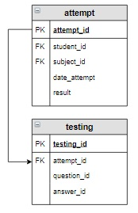

# Задание

**Задание**

Удалить из таблицы `attempt` все попытки, выполненные раньше 1 мая 2020 года. Также удалить и все соответствующие этим попыткам вопросы из таблицы `testing`, которая создавалась следующим запросом:

```mysql
CREATE TABLE testing (
    testing_id INT PRIMARY KEY AUTO_INCREMENT, 
    attempt_id INT, 
    question_id INT, 
    answer_id INT,
    FOREIGN KEY (attempt_id)  REFERENCES attempt (attempt_id) ON DELETE CASCADE
);
```

**Фрагмент логической схемы базы данных:**

<p float="left">

</p>

Введите SQL запрос

*Результат:*

```mysql
Affected rows: 6
```

```mysql
DELETE FROM attempt
WHERE date_attempt < '2020-05-01';
```

Вы получили: 1 балл из 1
