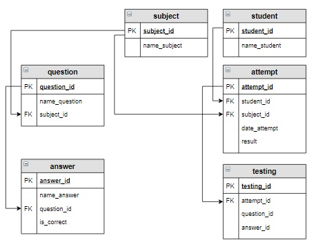

# Задание

**Задание**

Придумайте один или несколько запросов корректировки данных для предметной области «Тестирование» (в таблицы занесены данные, как на первом шаге урока). Проверьте, правильно ли они работают.

Выбрать те вопросы, где студенты допустили одну и ту же ошибку наибольшее количество раз. Вывести ответ и количество раз, сколько выбрали этот ответ. (Исходя из таблицы `testing` это ответ 16, который является неверным, его ученики выбрали два раза).

**Логическая схема базы данных:**

<p float="left">

</p>

Введите SQL запрос

*Результат:*

```mysql
Query result:
+-------------------------------------+----------------------+-------------------+
| LEFT(name_question, 35)             | LEFT(name_answer,20) | Количество_ошибок |
+-------------------------------------+----------------------+-------------------+
| Для внутреннего соединения таблиц и | CROSS JOIN           | 2                 |
+-------------------------------------+----------------------+-------------------+
Affected rows: 1
```

```mysql
SELECT LEFT(name_question, 35), LEFT(name_answer,20), COUNT(is_correct) AS Количество_ошибок 
FROM question
     JOIN testing ON question.question_id=testing.question_id
     JOIN answer ON answer.answer_id=testing.answer_id AND answer.is_correct=false
GROUP BY LEFT(name_question, 35), LEFT(name_answer,20)
HAVING COUNT(is_correct)=(SELECT MAX(Количество_ошибок)
                          FROM (SELECT testing.answer_id, COUNT(is_correct) AS Количество_ошибок
                                FROM testing JOIN answer ON answer.answer_id=testing.answer_id AND
                                                            answer.is_correct=false
                                GROUP BY testing.answer_id) AS query_1);
```

Вы получили: 1 балл из 1
