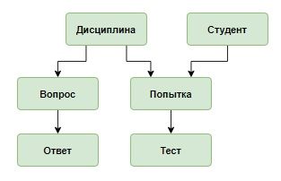

# База данных «Тестирование», запросы корректировки

В данном уроке с помощью запросов корректировки для базы данных «Тестирование» будет реализован процесс подготовки вопросов для тестирования и обработки результатов попытки студента:
- добавление новой попытки для определенного студента и определенной дисциплины;
- формирование тестовых вопросов для этой попытки;
- вычисление результата тестирования;
- удаление неактуальных попыток.

***Структура таблиц и их наполнение как на первом шаге предыдущего урока.***

**Концептуальная схема базы данных**

**Логическая схема базы данных**

**Структура и наполнение таблиц**

Таблица `subject`:

| **subject_id**                   | **name_subject**  |
|:---------------------------------|:------------------|
| `INT PRIMARY KEY AUTO_INCREMENT` | `VARCHAR(30)`     |
| 1                                | Основы SQL        |
| 2                                | Основы баз данных |
| 3                                | Физика            |

Таблица  `student`:

| **student_id**                   | **name_student** |
|:---------------------------------|:-----------------|
| `INT PRIMARY KEY AUTO_INCREMENT` | `VARCHAR(50)`    |
| 1                                | Баранов Павел    |
| 2                                | Абрамова Катя    |
| 3                                | Семенов Иван     |
| 4                                | Яковлева Галина  |

Таблица `attempt` (в таблице хранится информация о каждой попытке сдачи теста: `id` студента, `id` дисциплины, дата попытки и результат в процентах):

| **attempt_id**                   | **student_id** | **subject_id** | **date_attempt** | **result** |
|:---------------------------------|:---------------|:---------------|:-----------------|:-----------|
| `INT PRIMARY KEY AUTO_INCREMENT` | `INT`          | `INT`          | `DATE`           | `INT`      |
| 1                                | 1              | 2              | 2020-03-23       | 67         |
| 2                                | 3              | 1              | 2020-03-23       | 100        |
| 3                                | 4              | 2              | 2020-03-26       | 0          |
| 4                                | 1              | 1              | 2020-04-15       | 33         |
| 5                                | 3              | 1              | 2020-04-15       | 67         |
| 6                                | 4              | 2              | 2020-04-21       | 100        |
| 7                                | 3              | 1              | 2020-05-17       | 33         |

Таблица `question` (таблица содержит вопросы по каждой дисциплине):

| **question_id**                  | **name_question**                                                       | **subject_id** | 
|:---------------------------------|:------------------------------------------------------------------------|:---------------| 
| `INT PRIMARY KEY AUTO_INCREMENT` | `VARCHAR(100)`                                                          | `INT`          | 
| 1                                | Запрос на выборку начинается с ключевого слова:                         | 1              |
| 2                                | Условие, по которому отбираются записи, задается после ключевого слова: | 1              |
| 3                                | Для сортировки используется:                                            | 1              |
| 4                                | Какой запрос выбирает все записи из таблицы student:                    | 1              |
| 5                                | Для внутреннего соединения таблиц используется оператор:                | 1              |
| 6                                | База данных - это:                                                      | 2              |
| 7                                | Отношение - это:                                                        | 2              |
| 8                                | Концептуальная модель используется для                                  | 2              |
| 9                                | Какой тип данных не допустим в реляционной таблице?                     | 2              |

Таблица `answer` (в таблице содержатся варианты ответов на каждый вопрос, для правильного варианта столбец `is_correct` имеет значение `true`):

| **subject_id**                   | **name_subject**                                                           | **name_subject** | **name_subject** |
|:---------------------------------|:---------------------------------------------------------------------------|:-----------------|:-----------------|
| `INT PRIMARY KEY AUTO_INCREMENT` | `VARCHAR(100)`                                                             | `INT`            | `BOOL`           |
| 1                                | UPDATE                                                                     | 1                | false            |
| 2                                | SELECT                                                                     | 1                | true             |
| 3                                | INSERT                                                                     | 1                | false            |
| 4                                | GROUP BY                                                                   | 2                | false            |
| 5                                | FROM                                                                       | 2                | false            |
| 6                                | WHERE                                                                      | 2                | true             |
| 7                                | SELECT                                                                     | 2                | false            |
| 8                                | SORT                                                                       | 3                | false            |
| 9                                | ORDER BY                                                                   | 3                | true             |
| 10                               | RANG BY                                                                    | 3                | false            |
| 11                               | SELECT * FROM student                                                      | 4                | true             |
| 12                               | SELECT student                                                             | 4                | false            |
| 13                               | INNER JOIN                                                                 | 5                | true             |
| 14                               | LEFT JOIN                                                                  | 5                | false            |
| 15                               | RIGHT JOIN                                                                 | 5                | false            |
| 16                               | CROSS JOIN                                                                 | 5                | false            |
| 17                               | совокупность данных, организованных по определенным правилам               | 6                | true             |
| 18                               | совокупность программ для хранения и обработки больших массивов информации | 6                | false            |
| 19                               | строка                                                                     | 7                | false            |
| 20                               | столбец                                                                    | 7                | false            |
| 21                               | таблица                                                                    | 7                | true             |
| 22                               | обобщенное представление пользователей о данных                            | 8                | true             |
| 23                               | описание представления данных в памяти компьютера                          | 8                | false            |
| 24                               | база данных                                                                | 8                | false            |
| 25                               | file                                                                       | 9                | true             |
| 26                               | INT                                                                        | 9                | false            |
| 27                               | VARCHAR                                                                    | 9                | false            |
| 28                               | DATE                                                                       | 9                | false            |

Таблица `testing` (в таблице хранится информация о каждой попытке студента: какие вопросы были заданы и какой ответ дал студент)

| **testing_id**                   | **attempt_id** | **question_id** | **answer_id** |
|:---------------------------------|:---------------|:----------------|:--------------|
| `INT PRIMARY KEY AUTO_INCREMENT` | `INT`          | `INT`           | `INT`         |
| 1                                | 1              | 9               | 25            |
| 2                                | 1              | 7               | 19            |
| 3                                | 1              | 6               | 17            |
| 4                                | 2              | 3               | 9             |
| 5                                | 2              | 1               | 2             |
| 6                                | 2              | 4               | 11            |
| 7                                | 3              | 6               | 18            |
| 8                                | 3              | 8               | 24            |
| 9                                | 3              | 9               | 28            |
| 10                               | 4              | 1               | 2             |
| 11                               | 4              | 5               | 16            |
| 12                               | 4              | 3               | 10            |
| 13                               | 5              | 2               | 6             |
| 14                               | 5              | 1               | 2             |
| 15                               | 5              | 4               | 12            |
| 16                               | 6              | 6               | 17            |
| 17                               | 6              | 8               | 22            |
| 18                               | 6              | 7               | 21            |
| 19                               | 7              | 1               | 3             |
| 20                               | 7              | 4               | 11            |
| 21                               | 7              | 5               | 16            |
