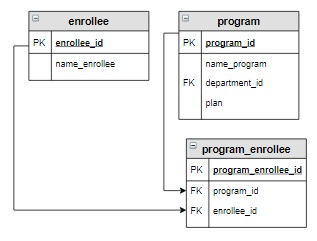

# Задание

**Задание**

Вывести абитуриентов, которые хотят поступать на образовательную программу «Мехатроника и робототехника» в отсортированном по фамилиям виде.

**Фрагмент логической схемы базы данных:**

<p float="left">

</p>

Введите SQL запрос

*Результат:*

```mysql
Query result:
+-----------------+
| name_enrollee   |
+-----------------+
| Баранов Павел   |
| Попов Илья      |
| Семенов Иван    |
| Степанова Дарья |
+-----------------+
Affected rows: 4
```

```mysql
SELECT name_enrollee
FROM program_enrollee
     INNER JOIN program USING(program_id)
     INNER JOIN enrollee USING(enrollee_id)
WHERE name_program = 'Мехатроника и робототехника'
ORDER BY name_enrollee;
```

Вы получили: 1 балл из 1
