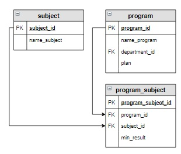

# Задание

**Задание**

Вывести образовательные программы, на которые для поступления необходим предмет «Информатика». Программы отсортировать в обратном алфавитном порядке.

**Фрагмент логической схемы базы данных:**

<p float="left">

</p>

Введите SQL запрос

*Результат:*

```mysql
Query result:
+-------------------------------------+
| name_program                        |
+-------------------------------------+
| Прикладная математика и информатика |
| Математика и компьютерные науки     |
+-------------------------------------+
Affected rows: 2
```

```mysql
SELECT name_program
FROM program_subject
     INNER JOIN program USING(program_id)
     INNER JOIN subject USING(subject_id)
WHERE name_subject = 'Информатика'
ORDER BY name_program DESC;
```

Вы получили: 1 балл из 1
