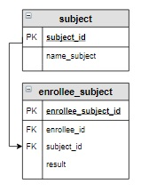

# Задание

**Задание**

Выведите количество абитуриентов, сдавших ЕГЭ по каждому предмету, максимальное, минимальное и среднее значение баллов по предмету ЕГЭ. Вычисляемые столбцы назвать `Количество`, `Максимум`, `Минимум`, `Среднее`. Информацию отсортировать по названию предмета в алфавитном порядке, среднее значение округлить до одного знака после запятой.

**Фрагмент логической схемы базы данных:**

<p float="left">

</p>

Введите SQL запрос

*Результат:*

```mysql
Query result:
+--------------+------------+----------+---------+---------+
| name_subject | Количество | Максимум | Минимум | Среднее |
+--------------+------------+----------+---------+---------+
| Информатика  | 4          | 94       | 75      | 82.0    |
| Математика   | 6          | 92       | 67      | 75.3    |
| Русский язык | 6          | 90       | 65      | 77.5    |
| Физика       | 5          | 90       | 41      | 69.8    |
+--------------+------------+----------+---------+---------+
Affected rows: 4
```

```mysql
SELECT name_subject,
       COUNT(enrollee_id) AS Количество,
       MAX(result) AS Максимум,
       MIN(result) AS Минимум,
       ROUND(AVG(result),1) AS Среднее
FROM enrollee_subject INNER JOIN subject USING(subject_id)
GROUP BY name_subject
ORDER BY name_subject;
```

Вы получили: 1 балл из 1
