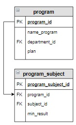

# Задание

**Задание**

Вывести образовательные программы, для которых минимальный балл ЕГЭ по каждому предмету больше или равен 40 баллам. Программы вывести в отсортированном по алфавиту виде.

**Фрагмент логической схемы базы данных:**

<p float="left">

</p>

Введите SQL запрос

*Результат:*

```mysql
Query result:
+-------------------------------------+
| name_program                        |
+-------------------------------------+
| Мехатроника и робототехника         |
| Прикладная математика и информатика |
+-------------------------------------+
Affected rows: 2
```

```mysql
SELECT name_program
FROM program INNER JOIN program_subject USING(program_id)
GROUP BY name_program
HAVING MIN(min_result) >= 40
ORDER BY name_program;
```

Вы получили: 1 балл из 1
