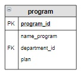

# Задание

**Задание**

Вывести образовательные программы, которые имеют самый большой план набора,  вместе с этой величиной.

**Фрагмент логической схемы базы данных:**

<p float="left">

</p>

Введите SQL запрос

*Результат:*

```mysql
Query result:
+-----------------------------+------+
| name_program                | plan |
+-----------------------------+------+
| Мехатроника и робототехника | 3    |
+-----------------------------+------+
Affected rows: 1
```

```mysql
SELECT name_program, plan
FROM program
WHERE plan = (SELECT MAX(plan) FROM program);
```

Вы получили: 1 балл из 1
