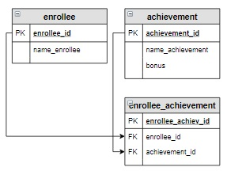

# Задание

**Задание**

Посчитать, сколько дополнительных баллов получит каждый абитуриент. Столбец с дополнительными баллами назвать `Бонус`. Информацию вывести в отсортированном по фамилиям виде.

**Фрагмент логической схемы базы данных:**

<p float="left">

</p>

Введите SQL запрос

*Результат:*

```mysql
Query result:
+-----------------+-------+
| name_enrollee   | Бонус |
+-----------------+-------+
| Абрамова Катя   | 0     |
| Баранов Павел   | 6     |
| Попов Илья      | 8     |
| Семенов Иван    | 5     |
| Степанова Дарья | 0     |
| Яковлева Галина | 1     |
+-----------------+-------+
Affected rows: 6
```

```mysql
SELECT name_enrollee, SUM(IF(bonus IS NULL, 0, bonus)) AS Бонус
FROM enrollee_achievement
     RIGHT JOIN enrollee USING(enrollee_id)
     LEFT JOIN achievement USING(achievement_id)
GROUP BY name_enrollee
ORDER BY name_enrollee;
```

Вы получили: 1 балл из 1
