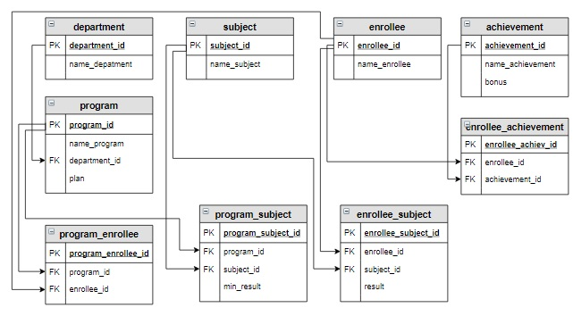

# Задание

**Задание**

Вывести образовательные программы, на которые для поступления необходимы предмет «Информатика» и «Математика» в отсортированном по названию программ виде.

**Логическая схемы базы данных (чтобы потренироваться выбирать таблицы для запроса):**

<p float="left">

</p>

Введите SQL запрос

*Результат:*

```mysql
Query result:
+-------------------------------------+
| name_program                        |
+-------------------------------------+
| Математика и компьютерные науки     |
| Прикладная математика и информатика |
+-------------------------------------+
Affected rows: 2
```

```mysql
SELECT name_program
FROM program
     INNER JOIN program_subject USING(program_id)
     INNER JOIN subject USING(subject_id)
WHERE name_subject = 'Информатика' OR name_subject = 'Математика'
GROUP BY name_program
HAVING COUNT(name_subject) = 2
ORDER BY name_program;
```

Вы получили: 1 балл из 1
