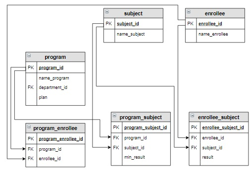

# Задание

**Задание**

Посчитать количество баллов каждого абитуриента на каждую образовательную программу, на которую он подал заявление, по результатам ЕГЭ. В результат включить название образовательной программы, фамилию и имя абитуриента, а также столбец с суммой баллов, который назвать `itog`. Информацию вывести в отсортированном сначала по образовательной программе, а потом по убыванию суммы баллов виде.

**Фрагмент логической схемы базы данных:**

<p float="left">

</p>

Введите SQL запрос

*Результат:*

```mysql
Query result:
+-------------------------------------+-----------------+------+
| name_program                        | name_enrollee   | itog |
+-------------------------------------+-----------------+------+
| Математика и компьютерные науки     | Степанова Дарья | 276  |
| Математика и компьютерные науки     | Семенов Иван    | 230  |
| Математика и компьютерные науки     | Абрамова Катя   | 226  |
| Мехатроника и робототехника         | Степанова Дарья | 270  |
| Мехатроника и робототехника         | Семенов Иван    | 242  |
| Мехатроника и робототехника         | Попов Илья      | 192  |
| Мехатроника и робототехника         | Баранов Павел   | 179  |
| Прикладная математика и информатика | Семенов Иван    | 230  |
| Прикладная математика и информатика | Абрамова Катя   | 226  |
| Прикладная математика и информатика | Баранов Павел   | 213  |
| Прикладная механика                 | Степанова Дарья | 270  |
| Прикладная механика                 | Яковлева Галина | 238  |
| Прикладная механика                 | Попов Илья      | 192  |
| Прикладная механика                 | Баранов Павел   | 179  |
+-------------------------------------+-----------------+------+
Affected rows: 14
```

```mysql
SELECT name_program, name_enrollee, SUM(result) AS itog
FROM program
     INNER JOIN program_enrollee USING(program_id)
     INNER JOIN program_subject USING(program_id)
     INNER JOIN enrollee USING(enrollee_id)
     INNER JOIN subject ON subject.subject_id = program_subject.subject_id
     INNER JOIN enrollee_subject ON enrollee_subject.enrollee_id = enrollee.enrollee_id AND
                                    enrollee_subject.subject_id = program_subject.subject_id
GROUP BY name_program, name_enrollee 
ORDER BY name_program, itog DESC;
```

Вы получили: 1 балл из 1
