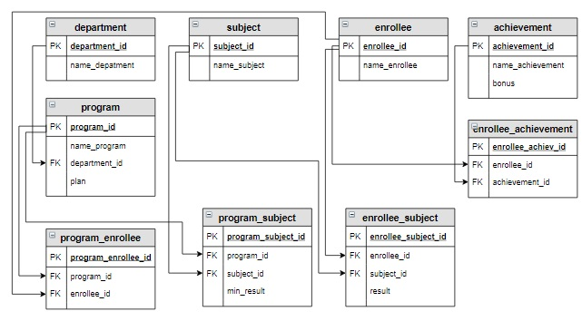

# Задание

**Задание**

Вывести название образовательной программы и фамилию тех абитуриентов, которые подавали документы на эту образовательную программу, но не могут быть зачислены на нее. Эти абитуриенты имеют результат по одному или нескольким предметам ЕГЭ, необходимым для поступления на эту образовательную программу, меньше минимального балла. Информацию вывести в отсортированном сначала по программам, а потом по фамилиям абитуриентов виде.

Например, Баранов Павел по «Физике» набрал 41 балл, а  для образовательной программы «Прикладная механика» минимальный балл по этому предмету определен в 45 баллов. Следовательно, абитуриент на данную программу не может поступить.

**Логическая схемы базы данных (чтобы потренироваться выбирать таблицы для запроса):**

<p float="left">

</p>

Для этого задания в базу данных добавлена строка:

```mysql
INSERT INTO enrollee_subject (enrollee_id, subject_id, result) VALUES (2, 3, 41);
```

Добавлен человек, который сдавал **Физику**, но не подал документы ни на одну образовательную программу, где этот предмет нужен.

Введите SQL запрос

*Результат:*

```mysql
Query result:
+-----------------------------+---------------+
| name_program                | name_enrollee |
+-----------------------------+---------------+
| Мехатроника и робототехника | Баранов Павел |
| Прикладная механика         | Баранов Павел |
+-----------------------------+---------------+
Affected rows: 2
```

```mysql
SELECT DISTINCT name_program, name_enrollee
FROM program
     INNER JOIN program_enrollee USING(program_id)
     INNER JOIN program_subject USING(program_id)
     INNER JOIN enrollee USING(enrollee_id)
     INNER JOIN subject ON subject.subject_id = program_subject.subject_id
     INNER JOIN enrollee_subject ON enrollee_subject.enrollee_id = enrollee.enrollee_id AND
                                    enrollee_subject.subject_id = program_subject.subject_id
WHERE result < min_result
GROUP BY name_program, name_enrollee 
ORDER BY name_program, name_enrollee;
```

Вы получили: 1 балл из 1
