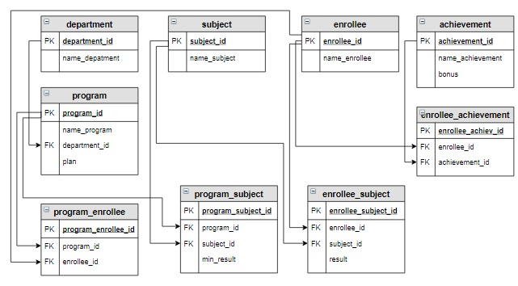

# Задание

**Задание**

Придумайте один или несколько запросов на выборку для предметной области «Абитуриент» (в таблицы занесены данные, как на первом шаге урока). Проверьте, правильно ли они работают.

**Логическая схема базы данных:**

<p float="left">

</p>

Введите SQL запрос

*Результат:*

```mysql
Query result:
+-------------------------------------+-----------------+--------------+--------+-------------+
| name_program                        | name_enrollee   | name_subject | result | Бал         |
+-------------------------------------+-----------------+--------------+--------+-------------+
| Математика и компьютерные науки     | Абрамова Катя   | Информатика  | 81     | Проходной   |
| Математика и компьютерные науки     | Абрамова Катя   | Русский язык | 75     | Проходной   |
| Математика и компьютерные науки     | Абрамова Катя   | Математика   | 70     | Проходной   |
| Математика и компьютерные науки     | Семенов Иван    | Русский язык | 85     | Проходной   |
| Математика и компьютерные науки     | Семенов Иван    | Информатика  | 78     | Проходной   |
| Математика и компьютерные науки     | Семенов Иван    | Математика   | 67     | Проходной   |
| Математика и компьютерные науки     | Степанова Дарья | Информатика  | 94     | Проходной   |
| Математика и компьютерные науки     | Степанова Дарья | Математика   | 92     | Проходной   |
| Математика и компьютерные науки     | Степанова Дарья | Русский язык | 90     | Проходной   |
| Мехатроника и робототехника         | Баранов Павел   | Математика   | 70     | Проходной   |
| Мехатроника и робототехника         | Баранов Павел   | Русский язык | 68     | Проходной   |
| Мехатроника и робототехника         | Баранов Павел   | Физика       | 41     | Непроходной |
| Мехатроника и робототехника         | Попов Илья      | Математика   | 67     | Проходной   |
| Мехатроника и робототехника         | Попов Илья      | Русский язык | 65     | Проходной   |
| Мехатроника и робототехника         | Попов Илья      | Физика       | 60     | Проходной   |
| Мехатроника и робототехника         | Семенов Иван    | Физика       | 90     | Проходной   |
| Мехатроника и робототехника         | Семенов Иван    | Русский язык | 85     | Проходной   |
| Мехатроника и робототехника         | Семенов Иван    | Математика   | 67     | Проходной   |
| Мехатроника и робототехника         | Степанова Дарья | Математика   | 92     | Проходной   |
| Мехатроника и робототехника         | Степанова Дарья | Русский язык | 90     | Проходной   |
| Мехатроника и робототехника         | Степанова Дарья | Физика       | 88     | Проходной   |
| Прикладная математика и информатика | Абрамова Катя   | Информатика  | 81     | Проходной   |
| Прикладная математика и информатика | Абрамова Катя   | Русский язык | 75     | Проходной   |
| Прикладная математика и информатика | Абрамова Катя   | Математика   | 70     | Проходной   |
| Прикладная математика и информатика | Баранов Павел   | Информатика  | 75     | Проходной   |
| Прикладная математика и информатика | Баранов Павел   | Математика   | 70     | Проходной   |
| Прикладная математика и информатика | Баранов Павел   | Русский язык | 68     | Проходной   |
| Прикладная математика и информатика | Семенов Иван    | Русский язык | 85     | Проходной   |
| Прикладная математика и информатика | Семенов Иван    | Информатика  | 78     | Проходной   |
| Прикладная математика и информатика | Семенов Иван    | Математика   | 67     | Проходной   |
| Прикладная механика                 | Баранов Павел   | Математика   | 70     | Проходной   |
| Прикладная механика                 | Баранов Павел   | Русский язык | 68     | Проходной   |
| Прикладная механика                 | Баранов Павел   | Физика       | 41     | Непроходной |
| Прикладная механика                 | Попов Илья      | Математика   | 67     | Проходной   |
| Прикладная механика                 | Попов Илья      | Русский язык | 65     | Проходной   |
| Прикладная механика                 | Попов Илья      | Физика       | 60     | Проходной   |
| Прикладная механика                 | Степанова Дарья | Математика   | 92     | Проходной   |
| Прикладная механика                 | Степанова Дарья | Русский язык | 90     | Проходной   |
| Прикладная механика                 | Степанова Дарья | Физика       | 88     | Проходной   |
| Прикладная механика                 | Яковлева Галина | Математика   | 86     | Проходной   |
| Прикладная механика                 | Яковлева Галина | Русский язык | 82     | Проходной   |
| Прикладная механика                 | Яковлева Галина | Физика       | 70     | Проходной   |
+-------------------------------------+-----------------+--------------+--------+-------------+
Affected rows: 42
```

```mysql
SELECT name_program, name_enrollee, name_subject, result,
       IF(result >= min_result, 'Проходной', 'Непроходной') AS Бал
FROM program_enrollee
     INNER JOIN program_subject USING(program_id)
     INNER JOIN enrollee_subject ON enrollee_subject.subject_id = program_subject.subject_id AND 
                                    program_enrollee.enrollee_id = enrollee_subject.enrollee_id
     INNER JOIN program ON program_enrollee.program_id = program.program_id
     INNER JOIN enrollee ON enrollee.enrollee_id = program_enrollee.enrollee_id
     INNER JOIN department USING(department_id)
     INNER JOIN subject ON program_subject.subject_id = subject.subject_id
ORDER BY name_program, name_enrollee, result DESC;
```

Вы получили: 1 балл из 1
